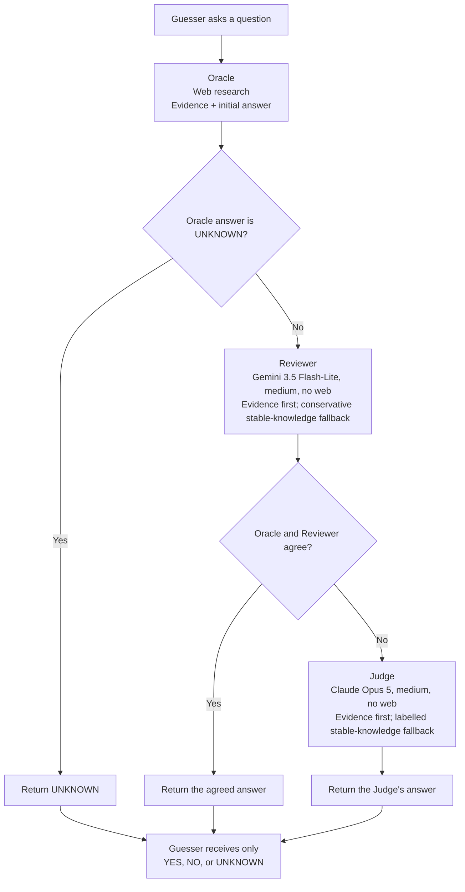

# Improve Oracle Answer Quality

## Problem

Deep20Bench relies on the Oracle to turn a Guesser's question into a trustworthy
`YES`, `NO`, or `UNKNOWN` answer. A wrong Oracle answer corrupts the benchmark:
the Guesser receives false information, its later questions and guesses are affected,
and the resulting score no longer measures the Guesser accurately.

This is not only a research or source-quality problem. An advanced model can retrieve
the correct fact and still produce the wrong final answer. Comparisons, negations,
date boundaries, and answer polarity are particularly vulnerable because the model
must perform two distinct tasks:

1. Find evidence relevant to the question.
2. Correctly apply the question's logic to that evidence.

### Observed Albert Schweitzer failure

The real benchmark run for Albert Schweitzer provides a clear example. During
`trial-004`, the Guesser asked:

> Was this person born before the year 1300?

The Oracle retrieved this evidence:

> Albert Schweitzer was born 14 January 1875.

The evidence was correct and directly answered the question. However, the Oracle
returned:

> YES

The correct answer is `NO`, because 1875 is later than 1300.

The same trial contained an earlier version of the same error:

> Was this person born before 1800?

The Oracle again cited an 1875 birth date and returned `YES`. In other trials, the
Oracle answered equivalent date questions correctly. This shows that the failure was
not caused by missing subject data or a consistently wrong factual belief. It was an
intermittent reasoning, comparison, or answer-polarity failure.

Prompt instructions alone are not a sufficient defense. The Oracle was already
instructed to handle dates, comparisons, and negation carefully. A model can still
make a locally inconsistent decision despite having the correct evidence in its own
output.

## Goal

Add an independent quality-control layer that catches incorrect Oracle answers while
preserving the Guesser's isolation and keeping expensive model use concentrated on
the small number of disputed questions.

The design uses exactly three roles:

- **Oracle** - researches the question and produces evidence plus an initial answer.
- **Reviewer** - independently checks the question, using evidence first and a
  conservative stable-knowledge fallback when evidence does not settle a closed fact.
- **Judge** - resolves disagreements using a stronger independent model.

The Judge is not a third vote in a majority system. When the Oracle and Reviewer
disagree, the Judge's answer becomes the final answer.

## Full Flow



### 1. Oracle

The Oracle receives only:

- the trusted subject snapshot; and
- the Guesser's current question.

The Oracle performs web research and returns:

- an initial `YES`, `NO`, or `UNKNOWN`;
- the evidence excerpts supporting that answer;
- source references; and
- usage, search, latency, and cost metrics.

The Oracle remains responsible for research. Neither the Reviewer nor the Judge
performs web searches in this design.

If the Oracle returns `UNKNOWN`, that answer is returned without review in the first
version. An `UNKNOWN` does not assert a fact that could mislead the Guesser, and it
will commonly indicate that the Oracle did not obtain sufficient evidence to review.

### 2. Reviewer

Every initial Oracle `YES` or `NO` is checked by the Reviewer.

The Reviewer uses Gemini 3.5 Flash-Lite at medium reasoning, pinned to Google AI
Studio with no web access. It receives:

- the trusted subject snapshot;
- the original question; and
- the Oracle's numbered evidence excerpts.

The Reviewer does **not** receive:

- the Oracle's answer;
- the Oracle's explanation or hidden reasoning;
- the Oracle's prompt or raw response;
- the Oracle's search process or provider trace;
- earlier Oracle answers from the episode; or
- any indication of what answer it is expected to confirm.

The Reviewer independently derives `YES`, `NO`, or `UNKNOWN`. It uses the supplied
evidence first, with particular care for negation, dates, quantities, boundaries, and
comparison direction. An evidence-based decision records `basis="evidence"` and
identifies the supporting excerpts.

If the evidence does not directly settle the question and is not contradictory, the
Reviewer may use high-confidence model knowledge only for a stable, widely
established, closed fact with a unique answer. Examples include sole authorship,
birthplace, creator, and inventor relations. Such a decision records
`basis="model_knowledge"` and no evidence indices. Authoritative counter-attribution
counts as evidence when the relation is uniquely attributable.

The Reviewer must not use model knowledge for current or disputed facts, subjective
claims, open-world relations, affiliations, citizenships, awards, visits, `ever`,
`only`, or complete or exact counts. It returns `UNKNOWN` when uncertain. This rule
is deliberately conservative because Oracle–Reviewer agreement bypasses the Judge.

After the Reviewer answers, the system compares the Oracle and Reviewer decisions:

- If they agree, their shared answer becomes final.
- If they disagree, including when the Reviewer returns `UNKNOWN`, the Judge is
  invoked.

### 3. Judge

The Judge runs only when the Oracle and Reviewer disagree. It uses Claude Opus 5 at
medium reasoning, pinned to Anthropic with no web access.

The Judge receives the same clean factual package as the Reviewer:

- the trusted subject snapshot;
- the original question; and
- the Oracle's numbered evidence excerpts.

The Judge does **not** receive:

- the Oracle's answer;
- the Reviewer's answer;
- either model's explanation or hidden reasoning;
- a statement that one model said `YES` and the other said `NO`; or
- any instruction favoring one of the earlier decisions.

The system knows that a disagreement triggered the Judge, but the Judge's prompt
does not reveal the direction of that disagreement. This avoids anchoring the Judge
to either earlier conclusion.

The Judge independently returns `YES`, `NO`, or `UNKNOWN`. Its decision is final; it
does not create a two-out-of-three vote. It uses the supplied evidence first. A
definite evidence-based decision identifies its supporting excerpts and records
`basis="evidence"`.

When the supplied excerpts are insufficient but not contradictory, the Judge has one
narrow fallback: it may answer from high-confidence model knowledge for a stable,
widely established fact with a closed and specific relation. Examples include the
sole author or creator of a named work and an unambiguous identity relation. Such a
decision records `basis="model_knowledge"` and no evidence indices. This makes the
source of the decision explicit instead of allowing the Judge to cite an irrelevant
excerpt for a conclusion it actually drew from memory.

The fallback does not apply to current or recent facts, disputed or ambiguous claims,
subjective descriptions, or open-world claims about citizenships, affiliations,
visits, awards, complete lists, exact counts, `ever`, `only`, or `more than one`.
Those questions require direct evidence. If neither the evidence rule nor the narrow
fallback applies, the Judge returns `UNKNOWN`.

The additional quality comes from giving the disputed case to a more capable model
with a narrow reasoning task and without the distraction of web research. The
labelled fallback also uses the stronger model's stable factual knowledge without
misrepresenting it as web evidence. The Judge is expensive only on the disagreement
path.

### Why negative facts need a bounded fallback

Web pages usually state what is true. They rarely enumerate every false relation.
For example:

> Did Albert Schweitzer write *Being and Time*?

The correct answer is `NO`; *Being and Time* was written by Martin Heidegger. A
search may readily find sources attributing the work to Heidegger, but it is unlikely
to find a page that literally says “Albert Schweitzer did not write *Being and
Time*.” Requiring an explicit negative sentence in every case can therefore turn an
obvious stable fact into `UNKNOWN`.

The best evidence path is direct counter-attribution: an authoritative catalog that
names Heidegger as the sole author closes the authorship relation and supports `NO`.
If the Oracle fails to provide that excerpt, the Judge may still answer `NO` from
high-confidence model knowledge and label the decision honestly.

This reasoning cannot be generalized to all negative questions. Suppose the question
is whether a person won two Nobel Prizes and the only excerpt says the person won the
Physics prize. That excerpt proves one award, not a complete lifetime count. A search
report saying that no second prize was found also does not prove there was none.
Awards are an open-world collection, so missing evidence still requires `UNKNOWN`
unless a direct exact count or complete authoritative list resolves the question.

The wire distinction is explicit. A sole-author counter-attribution uses:

```json
{"answer":"NO","basis":"evidence","evidence_indices":[1]}
```

A stable-knowledge decision uses:

```json
{"answer":"NO","basis":"model_knowledge","evidence_indices":[]}
```

### 4. Final answer

Exactly one final token is produced for the game:

- Oracle `UNKNOWN` → final `UNKNOWN`.
- Oracle and Reviewer agree → their shared answer is final.
- Oracle and Reviewer disagree → the Judge's answer is final.

The Guesser receives only that final `YES`, `NO`, or `UNKNOWN`. All internal calls
still belong to one counted Guesser turn.

## How the flow handles the Albert Schweitzer example

For the question:

> Was this person born before the year 1300?

the flow would operate as follows:

1. The Oracle searches the web, finds the birth date 14 January 1875, and
   provisionally returns `YES`.
2. The Reviewer sees the question and the 1875 evidence, but not the Oracle's
   `YES`. It independently compares 1875 with 1300 and returns `NO`.
3. The disagreement invokes the Judge.
4. The Judge sees the same question and evidence, but neither previous answer. With
   medium reasoning, it independently returns `NO`.
5. The Guesser receives only the final `NO`.

This is exactly the class of failure the design is intended to catch: the evidence
is correct, but the Oracle applies the evidence incorrectly.

## Why this adds quality

The three roles separate responsibilities:

- The Oracle combines research and reasoning. It can therefore find the correct fact
  but make a mistake while translating that fact into an answer.
- The Reviewer performs evidence-first reasoning and may use bounded stable knowledge
  when the evidence does not settle a closed fact. It provides an independent,
  inexpensive check without repeating the web-search workload.
- The Judge focuses a stronger independent model on cases where the first two
  independent conclusions conflict.

Blind review matters. If the Reviewer or Judge saw the Oracle's answer, it could be
anchored by that answer and produce a justification for it. Hiding prior decisions
forces each role to solve the question independently.

The design also avoids treating three answers as equally reliable votes. The Oracle
has the harder combined research-and-reasoning task, the Reviewer is a medium model,
and the Judge is deliberately selected as the final authority for disputed cases.

## Limitation

The Reviewer and Judge both use evidence first and can repair a small class of
missing-evidence failures through a labelled stable-knowledge fallback. Neither role
performs fresh research. They cannot reliably repair false or contradictory evidence,
and parametric knowledge is not a substitute for current, disputed, subjective,
open-world, or exhaustive evidence.

The typed contract can enforce the role, basis, and evidence-index rules, but it cannot
prove that a memory-backed fact is truly stable or that the model's confidence is
well calibrated. `basis="model_knowledge"` is an audit label, not a citation or a
ground-truth certificate. Memory-backed decisions should therefore be measured and
sampled in post-run review. If they show material errors, the safe response is to
narrow or remove the fallback, or add fresh research on the disagreement path.

Reviewer memory has a larger consequence than Judge memory: a Reviewer answer that
agrees with the Oracle becomes final without an Opus Judge call. This should reduce
Judge interventions for obvious stable facts, but it can also allow a correlated
Oracle–Reviewer error to bypass the stronger model. The conservative scope, explicit
basis label, and post-run sampling are therefore part of the correctness design, not
only cost controls.

The Reviewer fallback runs for every initial Oracle `YES` or `NO`; the Judge fallback
runs only after an Oracle–Reviewer disagreement. Under the current flow, an initial
Oracle `UNKNOWN` remains final and does not invoke either quality-control role. The
fallback therefore cannot rescue a case that the research Oracle already classified
as `UNKNOWN`; changing that gate would be a separate adjudication design.

For example, if the Oracle supplied an incorrect birth year and both later models
accepted it, the final answer could still be wrong. The disagreement rate and
post-run audits should therefore be used to determine whether a future version also
needs fresh research on the disagreement path. That extension is not part of this
initial design.

## Isolation Requirements

Guesser isolation remains the highest-priority invariant.

- The Guesser never sees the Oracle, Reviewer, or Judge prompts.
- The Guesser never sees evidence, citations, explanations, disagreement state,
  model identities, retries, costs, or internal failures.
- The Reviewer and Judge never share a conversation or session with the Guesser.
- The Reviewer and Judge use separate prompt-cache and session namespaces from the
  Oracle and Guesser.
- No answer or raw response is reused through an application-level response cache.
- The only adjudication information returned to the Guesser is the final
  protocol-defined answer token.
- Reports and audits may combine privileged information only after the relevant
  model calls, and that information must never enter a later Guesser request.

The Oracle's existing input boundary remains unchanged: it receives only the trusted
subject snapshot and current Guesser question. The Reviewer and Judge are separate
components with explicit, typed evidence-review inputs.

## Configuration

Each role must be independently configurable:

- **Oracle:** existing web-enabled model, provider, reasoning effort, search engine,
  and search limits.
- **Reviewer:** `google/gemini-3.5-flash-lite` at medium reasoning, pinned to
  `google-ai-studio`, with web access disabled.
- **Judge:** `anthropic/claude-opus-5` at medium reasoning, pinned to `anthropic`,
  with web access disabled.

The Oracle, Reviewer, and Judge defaults intentionally use different model vendors.
This diversity is meant to improve the chance of catching model-family-specific
reasoning errors. It does not change the blind input contract or make the Judge a
majority voter.

The same behavior should be used by benchmark runs, standalone game play, and
standalone Oracle queries so that answer quality does not depend on the entry point.

Changing this adjudication flow changes benchmark behavior and should therefore
create a new protocol version. Existing runs do not need migration.

## Failure Handling

The system must not silently substitute an unchecked answer when a required quality
control call fails.

- An Oracle infrastructure failure remains an Oracle infrastructure failure.
- A required Reviewer failure fails the adjudication operation.
- A required Judge failure fails the adjudication operation.
- A valid model decision of `UNKNOWN` is not an infrastructure failure.
- Schema retries remain internal to the component that produced the invalid output.

This keeps infrastructure reliability separate from semantic uncertainty.

## Logging and Measurement

Every question should retain structured metrics for the roles that actually ran:

- Oracle, Reviewer, and Judge decision labels;
- each Reviewer and Judge decision basis;
- whether the Oracle and Reviewer disagreed;
- whether the Judge was invoked;
- final answer and decision path;
- input, output, reasoning, and cached tokens per role;
- latency and cost per role;
- Oracle web-search and evidence counts; and
- retry and failure metadata.

All disagreement events should be recorded per turn, with aggregate reporting for:

- Oracle–Reviewer agreement rate;
- disagreement rate by question type;
- Judge answer distribution;
- frequency of final `UNKNOWN`;
- number and percentage of Oracle answers changed by the Judge;
- additional Reviewer cost on all reviewed questions;
- additional Judge cost on disputed questions; and
- total quality-control cost per benchmark trial.

Console logs must remain concise and must not print prompts, raw responses, evidence
excerpts, subject descriptions, or hidden reasoning. Detailed disagreement data
belongs in typed benchmark events and permitted private diagnostics, never in
Guesser-visible history.

## Prompt Caching

Provider-side prompt caching may be evaluated independently for the Reviewer and
Judge because their stable instructions and output schemas can precede the variable
question and evidence. Cache namespaces must remain role-specific and may reuse only
provider computation for an identical prefix; they must never reuse an earlier
answer or conversational state.

The current Google AI Studio Reviewer and Anthropic Judge must be measured
independently because their cache thresholds, controls, and prices differ.

No savings should be claimed until actual input tokens, cache reads and writes,
discounts, latency, and cost have been measured for the configured providers and
models. Prompts should not be lengthened merely to cross a cache threshold.

## Required Tests

The implementation should include:

1. Agreement tests proving that the Judge is not called when the Oracle and Reviewer
   agree.
2. Disagreement tests proving that the Judge is called and its answer becomes final.
3. `UNKNOWN` tests for the Oracle, Reviewer, and Judge branches.
4. Blindness tests proving that the Reviewer request contains no Oracle answer.
5. Blindness tests proving that the Judge request contains neither prior answer.
6. Guesser-projection tests proving that the Guesser receives only the final answer
   token and no evidence or disagreement metadata.
7. Session and cache-isolation tests for all four model roles: Guesser, Oracle,
   Reviewer, and Judge.
8. Failure tests proving that required Reviewer or Judge failures are not silently
   replaced by the Oracle answer.
9. Metrics and artifact tests covering agreement and disagreement paths.
10. A regression test for the Albert Schweitzer case:
    evidence says `1875`, the question asks `before 1300`, and the final answer must
    be `NO`.
11. A Reviewer closed-fact fallback test: “Did Albert Schweitzer write *Being and
    Time*?” may produce a Reviewer `NO` with `basis="model_knowledge"`, no evidence
    indices, and no Judge invocation when the Oracle also returned `NO`.
12. A Judge closed-fact fallback test for the disagreement path.
13. Contract and isolation tests proving that memory-backed decisions never claim
    supporting evidence or enter the Guesser-visible projection.

## Success Criteria

The change is successful when:

- every initial Oracle `YES` or `NO` receives an independent Reviewer decision;
- only disagreements invoke the stronger Judge;
- the Judge's decision is final on the disagreement path;
- the Albert Schweitzer failure is caught by a regression test;
- the Guesser-visible information boundary is unchanged;
- web use remains confined to the Oracle;
- every definite quality-control decision distinguishes evidence from the
  Reviewer or Judge's narrow model-knowledge fallback;
- disagreements and their costs are measurable without exposing private data; and
- benchmark, game, and standalone Oracle entry points apply the same flow.
