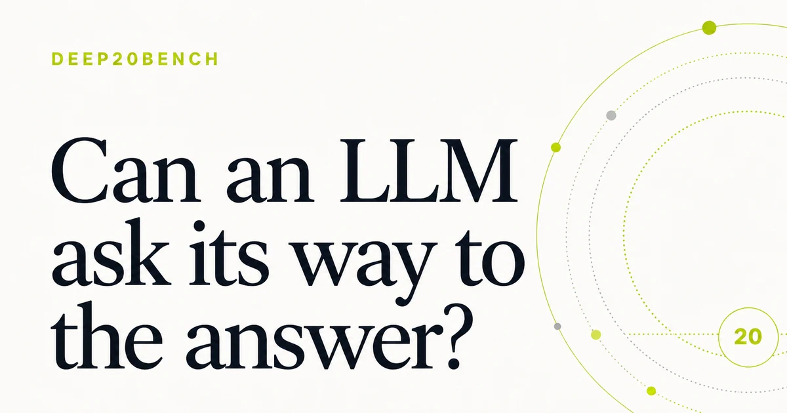

<p align="center">
  <a href="https://mindalyze-com.github.io/deep-20-bench/">
    <picture>
      <source media="(prefers-color-scheme: dark)" srcset="docs/og.webp">
      <source media="(prefers-color-scheme: light)" srcset="docs/og-light.webp">
      
    </picture>
  </a>
</p>

<h1 align="center">Deep20Bench</h1>

<p align="center">A public prototype for testing how AI models play Twenty Questions.</p>

<h2 align="center">
  <a href="https://mindalyze-com.github.io/deep-20-bench/">Open the homepage and pilot results →</a>
</h2>

<p align="center">
  <a href="https://mindalyze-com.github.io/deep-20-bench/results/">Results</a> ·
  <a href="https://mindalyze-com.github.io/deep-20-bench/methodology/">Method</a> ·
  <a href="https://mindalyze-com.github.io/deep-20-bench/data/">Data</a> ·
  <a href="https://github.com/mindalyze-com/deep-20-bench/discussions">Discussions</a>
</p>

Deep20Bench tests how well AI models identify a hidden person or character with yes-or-no
questions. It uses the Twenty Questions format with a 50-question ceiling, giving models more
room to finish a round.

The current pilot compares 12 model versions and settings across seven subjects, with five rounds
per subject. Lower scores are better. Results, transcripts, and scoring data are public.

## Run a local trial

Python 3.14.6 and [uv](https://docs.astral.sh/uv/) are required.

```bash
uv sync
```

Place an OpenRouter key in the ignored file `private/openrouter.yml`:

```yaml
api:
  api_key: your-openrouter-key
```

Run one experimental trial:

```bash
uv run deep20 benchmark run B-0001 \
  --model M-0001 \
  --benchmark-mode experimental \
  --targets T-0001 \
  --iterations 1 \
  --run-id BX-local-example
```

Benchmark runs make paid provider calls. `OPENROUTER_API_KEY` can be used as a temporary
credential override.

## Project documentation

- [Source layout](source/README.md)
- [Architecture](documentation/architecture.md)
- [Benchmark control plane](source/execution/benchmark/README.md)
- [Game engine](source/execution/game/README.md)
- [Oracle, Reviewer, and Judge](source/execution/oracle/Usage.md)
- [Publication package](source/publication/README.md)
- [Documentation index](documentation/README.md)

## Citation and license

Deep20Bench was created by Patrick Heusser and Markus Tuor. See [CITATION.cff](CITATION.cff) for
citation metadata.

The software is source-available under a dual-license model:
[PolyForm Noncommercial 1.0.0](LICENSES/PolyForm-Noncommercial-1.0.0.txt) for noncommercial use,
with separate commercial licenses available. Project-authored documentation and result data use
[Creative Commons Attribution 4.0](LICENSES/CC-BY-4.0.txt). See [LICENSE.md](LICENSE.md) for the
exact scope and third-party exclusions.
