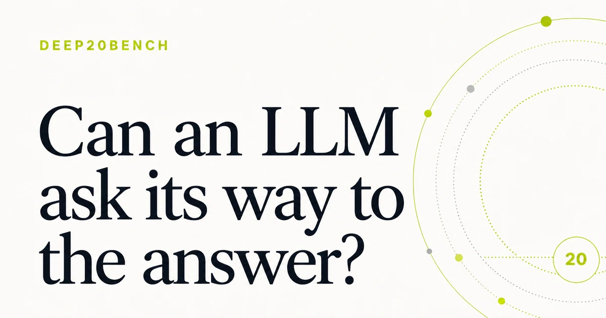

<p align="center">
  <a href="https://deep20bench.com/">
    <picture>
      <source media="(prefers-color-scheme: dark)" srcset="docs/og.webp">
      <source media="(prefers-color-scheme: light)" srcset="docs/og-light.webp">
      
    </picture>
  </a>
</p>

<h1 align="center">Deep20Bench</h1>

<p align="center">A public prototype for testing how AI models play Twenty Questions.</p>

<h2 align="center">
  <a href="https://deep20bench.com/">Open the homepage and results →</a>
</h2>

<p align="center">
  <a href="https://deep20bench.com/results/">Results</a> ·
  <a href="https://deep20bench.com/methodology/">Method</a> ·
  <a href="https://deep20bench.com/data/">Data</a> ·
  <a href="https://github.com/mindalyze-com/deep-20-bench/discussions">Discussions</a>
</p>

Deep20Bench tests how well AI models identify a hidden subject through factual questions.
Subjects include people, characters, types of things, and specific things. Each question builds
on earlier answers. New games use the Twenty Questions format with a 40-question limit.
Edition 1.1 adds Rather yes and Rather no to the three answers used by edition 1.0;
guesses still receive Yes, No, or Unknown.

Historical published runs retain their recorded 50-question limit and scores.

Each edition compares model versions and reasoning settings using the same subjects and scoring
rules. The subject set is small, so the results support only limited conclusions. See the
[current results](https://deep20bench.com/results/) for the tested models, number of rounds,
and scores. Lower scores are better. Results, game transcripts, and scoring data are public.

## Run one round locally

Python 3.14.6 and [uv](https://docs.astral.sh/uv/) are required.

```bash
uv sync
```

Place an OpenRouter key in the ignored file `private/openrouter.yml`:

```yaml
api:
  api_key: your-openrouter-key
```

Run one experimental round:

```bash
uv run deep20 benchmark run B-0001 \
  --model M-0001 \
  --benchmark-mode experimental \
  --targets T-0001 \
  --iterations 1 \
  --run-id BX-local-example
```

Benchmark runs make paid provider calls. You can also supply the key through
`OPENROUTER_API_KEY` instead of the file.

## Project documentation

- [Source layout](source/README.md)
- [Architecture](documentation/architecture.md)
- [Running benchmarks](source/execution/benchmark/README.md)
- [Game engine](source/execution/game/README.md)
- [Oracle, Reviewer, and Judge](source/execution/oracle/Usage.md)
- [Publication package](source/publication/README.md)
- [Documentation index](documentation/README.md)

## Citation and license

Deep20Bench was created by Patrick Heusser and Markus Tuor. See [CITATION.cff](CITATION.cff) for
citation details.

The software is source-available under a dual-license model:
[PolyForm Noncommercial 1.0.0](LICENSES/PolyForm-Noncommercial-1.0.0.txt) for noncommercial use,
with separate commercial licenses available. Project-authored documentation and result data use
[Creative Commons Attribution 4.0](LICENSES/CC-BY-4.0.txt). See [LICENSE.md](LICENSE.md) for the
exact scope and third-party exclusions.
