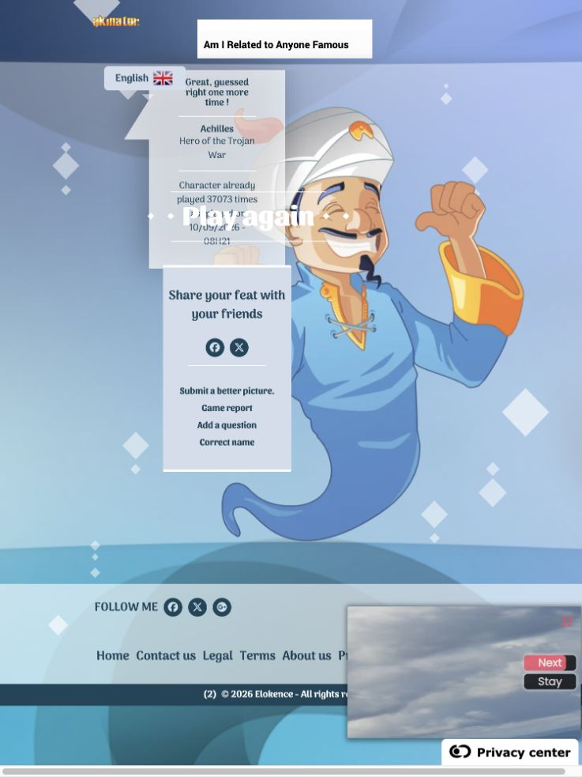
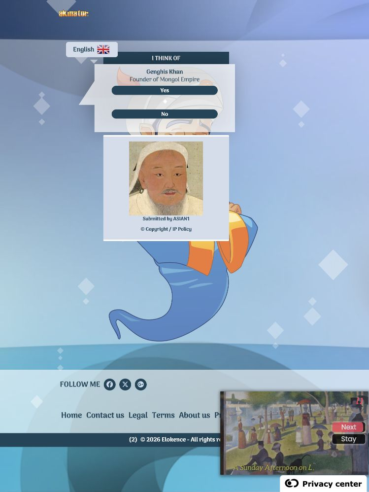

# Akinator with Codex answering - question-count analysis

**Analysis date: 10 September 2026.**

**Akinator averaged 23.56 factual questions per completed subject with Codex answering.** Nine completed games used 212 questions. Garfield and Moon used the fewest, at 15 each; Bike pump used the most, at 38.

Each of the ten subjects was attempted once. The single pass finished on 10 September 2026. Albert Schweitzer ended in a website technical error and was not repeated; its partial question count is excluded from the mean. All other subjects reached a correct guess or the 40-action limit.

## Question-count comparison

The primary measure is the **mean number of factual questions answered per completed game**, including games that reached the limit. Wrong guesses, format errors, Continue clicks and failure penalties are excluded. A lower value means fewer factual questions were used; a limit-stopped game does not establish how many questions identification would have required.

| Subject | Akinator with Oracle: mean questions | Akinator with Codex: mean questions | All tested LLMs: mean questions |
| --- | ---: | ---: | ---: |
| Albert Einstein | 31.5 | 20 | 10.08 |
| Albert Schweitzer | 32.0 | N/A | 22.97 |
| Garfield | 15.5 | 15 | 13.36 |
| Achilles | 35.5 | 24 | 10.56 |
| Genghis Khan | 27.5 | 18 | 14.36 |
| Bike pump | 39.0 | 38 | 32.00 |
| Spider web | 39.0 | 24 | 21.86 |
| Eyebrow | 39.0 | 28 | 19.25 |
| Moon | 27.0 | 15 | 11.47 |
| Door handle | 39.0 | 30 | 24.36 |
| **Average across subjects** | **32.50** | **23.56** | **18.03** |
| **Average across all completed games** | **32.44** | **23.56** | **18.04** |
| **Average across the same nine subjects** | **32.56** | **23.56** | **17.48** |

The LLM column includes all 12 model configurations with a saved final run under the comparable B-0003, five-answer, 40-action rules on these ten subjects. It uses the latest run of each configuration: 11 published edition 1.1 runs plus the later Muse Spark run. The one infrastructure-failed Muse Einstein trial is excluded, leaving 359 scored games: 35 for Einstein and 36 for every other subject. Earlier three-answer or 50-action experiments and superseded repeats of a model are not mixed into this column. See the [source snapshot](../llm-question-counts.json) and [selection details](../README.md#llm-reference-population).

For each LLM subject value, first average that model's completed trials, then average the 12 model means with equal weight. The subject-average row gives each available subject equal weight. The game-average row pools all completed games and therefore weights every trial equally: 584 questions across 18 Oracle games, 212 across nine self-answered games, and 6,477 across 359 LLM games. The LLM subject and game averages differ slightly because Muse has only two completed Einstein trials.

The Oracle subject average covers ten subjects; the self-answered average covers nine. The last row excludes Schweitzer from all three columns and gives each of the remaining nine subjects equal weight. Each self-answered subject has only one completed trial, so its question count and mean are identical. The unfinished Oracle Moon trial had 23 confirmed answers and is excluded. The self-answered Schweitzer attempt had 18 confirmed answers before a website error, plus one attempted answer whose acceptance is unknown; it is also excluded.

All Oracle limit failures used 39 factual questions and one wrong guess; the self-answered Bike pump used 38 factual questions and two wrong guesses. LLM model failures are included at their actual ASK count. The published Deep20Bench question score uses counted actions on identification and a value of 41 on failure under these rules; this report retains actual factual question counts as requested. Fewer questions can also reflect earlier termination or actions spent on guesses or format errors. See the [combined metric explanation](../README.md#question-count-comparison).

## Question totals

| Question measure | Value |
| --- | ---: |
| Mean questions per completed subject or game | **23.56** |
| Factual questions in 9 completed games | 212 |
| Character games: 77 questions across 4 games | 19.25 per game |
| Object games: 135 questions across 5 games | 27.00 per game |
| Confirmed questions in the interrupted Schweitzer game, excluded | 18 |
| Confirmed questions across all 10 starts | 230 |
| Additional attempted answer with unknown acceptance, excluded | 1 |

The completed games also used two rejected guesses, both for Bike pump. Those guesses consumed actions under the 40-action cap but are excluded from the question totals.

## Questions by subject

| Subject | Mean questions | Completed trials | Confirmed questions | Completion context |
| --- | ---: | ---: | ---: | --- |
| [Albert Einstein](games/T-0001-r1.md) | **20** | 1 | 20 | Identified |
| [Albert Schweitzer](games/T-0002-r1.md) | N/A | 0 | 18 partial | Website error; excluded |
| [Garfield](games/T-0004-r1.md) | **15** | 1 | 15 | Identified |
| [Achilles](games/T-0005-r1.md) | **24** | 1 | 24 | Identified |
| [Genghis Khan](games/T-0006-r1.md) | **18** | 1 | 18 | Identified |
| [Bike pump](games/T-0008-r1.md) | **38** | 1 | 38 | Limit: 38 questions + 2 wrong guesses |
| [Spider web](games/T-0009-r1.md) | **24** | 1 | 24 | Identified |
| [Eyebrow](games/T-0010-r1.md) | **28** | 1 | 28 | Identified |
| [Moon](games/T-0011-r1.md) | **15** | 1 | 15 | Identified |
| [Door handle](games/T-0012-r1.md) | **30** | 1 | 30 | Identified |

Each completed subject has one trial, so its mean question count equals its recorded count. Schweitzer has no completed-game mean; its 18 confirmed answers are partial progress, and Q19 acceptance is unknown.

## Where the questions accumulated

Garfield and Moon used **15 questions** each, followed by Genghis Khan at **18** and Einstein at **20**. Achilles and Spider web each used **24**, Eyebrow used **28**, and Door handle used **30**. These games ended at the first guess. Object games averaged **27.00 questions**, compared with **19.25** for the four completed character games.

Bike pump used the most questions: **38**, plus two rejected guesses. Akinator guessed "A lever" after Q30, then "An air pump" after Q35. The latter is a broader class than the target bicycle pump and was not accepted as exact identification. Q39 was displayed but left unanswered because 38 answered questions and two rejected guesses had exhausted the 40-action limit. Its observed count of 38 remains in the mean.

Schweitzer ended when the site displayed "A technical problem has occurred. Please try again." after the answer to Q19. The first 18 answers were confirmed. The Q19 No click and its unknown acceptance are preserved. No replacement game was started.

## Answer choices and limitations

Confirmed ASK answer distribution: Yes 83, No 112, Don't know 11, Probably 9, Probably not 15.

The answers aimed at ordinary meanings. Examples include distinguishing a natural eyebrow from cosmetic products, treating a bike pump as typically manual while retaining electric variants, and interpreting the whole Moon rather than lunar samples. The raw notes expose choices that another answerer might reasonably make differently.

Several judgments remain debatable: Achilles wearing a helmet versus a hat; character origin versus any adaptation; whether an eyebrow is "worn" on the forehead; and typical size or location for a broad object category. Genghis Khan language history received Probably not after a lookup, while unknown birthday and handedness questions received Don't know. These answers did not receive independent review and are not a verified factual gold standard.

Codex had already seen the paid arm, its answer-quality issues and some of its question paths. It also saw the self arm's earlier questions when answering later ones. The Oracle uses blind per-question projections and independent review. Akinator's server state, question selection, guess timing and possible learning from confirmations are uncontrolled. These results do not establish that answer quality alone caused the lower question count.

## Question-count differences from the paid arm

On the same nine subjects, Akinator averaged **23.56 questions with Codex answering versus 32.56 with the Oracle**, a reduction of **9.00 questions per subject**. The largest reductions were Spider web (39 to 24), Moon (27 to 15), Einstein (31.5 to 20), Achilles (35.5 to 24), and Eyebrow (39 to 28). Garfield changed little (15.5 to 15).

Bike pump's reduction from 39 to 38 questions came with an additional rejected guess; both arms used the full 40 actions. That difference does not indicate quicker identification. The all-LLM reference averaged **17.48 questions on these same nine subjects**, 6.08 fewer than Akinator with Codex. The [combined overview](../README.md) gives the trial coverage and [examines answer interpretation and Akinator's question paths](../README.md#interpreting-the-question-count-difference). These are descriptive comparisons with small and unequal samples.

## Spending

OpenRouter cost for this arm was **$0**. Codex usage is not priced in these artifacts. The paid Oracle arm remains at **$3.72214452 of its $7 cap**. This analysis reuses the saved records.

## Raw records and screenshots

- [Full readable questions and answers](questions-and-answers.md).
- [Raw question records](raw-questions-and-answers.jsonl), including exact wording, answers, notes, sources and verification state.
- [All web events](raw-web-events.jsonl), including guesses and continuations.
- [Machine-readable results](results.json) and [protocol](protocol.md).
- Per-game Markdown and JSON records are linked in the subject table.

Achilles: confirmed success after 24 questions.

Genghis Khan: correct guess after 18 questions, captured before the Yes confirmation; the subsequent confirmation was verified and saved.

