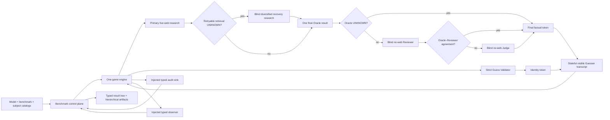

# Deep20Bench architecture

## Purpose and current boundary

Deep20Bench evaluates how effectively an LLM identifies a hidden subject through adaptive
yes/no questions. Each benchmark run binds one registered model and schedules it across selected
subjects and iterations. Each trial uses the one-game engine, session-aware Guesser,
independent live-web Oracle with blind Reviewer/Judge quality control, and strict LLM Guess
Validator. The control plane owns durable state, observation, logging, aggregation, and derived
reporting.

The Oracle researches each question against the live web. A typed primary research attempt may
trigger one separate, diversified recovery attempt when search returned no usable evidence.
The Oracle emits one final result after that internal research workflow. Every final `YES` or
`NO` is then checked by a blind no-web Reviewer. A blind no-web Judge produces the final answer
only when the Oracle and Reviewer disagree. Both quality-control roles use evidence first and may use
their own high-confidence knowledge only for stable closed facts, with an explicit
decision-basis label. The Reviewer applies this fallback conservatively because agreement
bypasses the Judge. Neither quality-control role receives either earlier answer. Deep20Bench
does not build or retain a factual knowledge base, reuse earlier answers, or send game history
to any adjudication role.



## Domain contracts

### Subject

A `Subject` is trusted benchmark configuration:

- `target_id`
- `canonical_name`
- `aliases`
- `entity_type`
- `description`
- optional `reference_url`

The entity type is shown to the Guesser as its broad category. The canonical name, aliases,
description, and reference URL remain hidden; the description only disambiguates identity for
the Oracle, Reviewer, Judge, and Guess Validator.

### Oracle request

An `OracleRequest` contains exactly:

- Run ID.
- Complete subject snapshot.
- Current yes/no question.

It never contains previous questions, answers, Guesser reasoning, or game state. Each call is
independent.

### Oracle result

`OracleResult.answer` is one of:

- `YES`
- `NO`
- `UNKNOWN`

`YES` and `NO` require one to three evidence items. `UNKNOWN` requires an empty evidence list.
Each evidence item has an HTTP(S) source URL, excerpt, and the fixed
`validation="model_reported"` label.

Before producing that final result, each provider-backed research attempt returns a strict
`OracleResearchAttemptResult`. It adds a classified research outcome and one to eight bounded,
model-reported query strings. The deterministic question class, attempt strategy, outcome,
query list, search-request count, annotations, evidence count, and resolution are private audit
data. Query strings are not verified provider telemetry and are never sent to the Guesser,
Reviewer, Judge, or a later research attempt.

### Evidence review and final adjudication

An `EvidenceReviewRequest`, used independently for Reviewer and Judge calls, contains exactly:

- Complete trusted subject snapshot.
- Current yes/no question.
- One to three numbered Oracle evidence excerpts.

It contains no Oracle answer, Reviewer answer, explanation, provider trace, search process, or
episode history. `EvidenceReviewResult.answer` is independently `YES`, `NO`, or `UNKNOWN`, and
its mandatory `basis` is `evidence` or `model_knowledge`. An evidence-based `YES` or `NO`
identifies supporting one-based evidence indices. A Reviewer or Judge model-knowledge `YES` or
`NO` identifies no evidence indices, so an inadequate excerpt cannot be represented as
support. `UNKNOWN` uses `evidence` with no indices.

The model-knowledge fallback is limited to stable, widely established, closed relations with a
unique answer, such as sole authorship, birthplace, creator, or inventor. It does not apply to
current, disputed, subjective, open-world, or completeness claims. For example, a
quality-control role may know that Albert Schweitzer did not write *Being and Time* even when
no page states that exact negative sentence. It may not infer that someone won only one Nobel
Prize merely because the supplied evidence mentions only the Physics prize. Authoritative
counter-attribution is evidence when the relation is uniquely attributable.

`OracleAdjudication` records the provisional Oracle answer, optional Reviewer and Judge
decisions, disagreement state, final answer, decision path, and deterministic question type.
An Oracle `UNKNOWN` is final without review. Reviewer `UNKNOWN` is a disagreement with an
initial Oracle `YES` or `NO`; Judge `UNKNOWN` is final.

`OracleCall.guesser_answer()` returns only this final answer enum. Game-engine code must use
that projection instead of formatting the research result, evidence, or quality-control state
into the Guesser conversation.

### Guesser action

The Guesser returns one strict object with a stable schema:

- `ASK` has a non-empty `question` and null identity fields.
- `GUESS` has a `name` and identifying `description` and a null question.

The immutable model configuration also fixes provider-side output enforcement. The default
`strict_json_schema` mode sends the complete action schema to OpenRouter. An explicitly
registered `json_object` route requests JSON-object formatting when its provider does not
support strict JSON Schema enforcement. Both modes use the same model-visible instructions and
the same strict local action validation. JSON-object output receives no repair or response
healing; any mismatch follows the normal scored `FORMAT_ERROR` path.

The Guesser initially receives the trusted entity type as a broad category. Its later
conversation contains only its canonically serialized valid actions and the corresponding
`YES`, `NO`, or `UNKNOWN` values, plus the one fixed `FORMAT_ERROR` event immediately after
its own invalid structured output. The raw output and validation details are never appended.
The correction consumes one counted turn and does not reveal whether the attempted content was
right or wrong. The exact wire shapes, final-opportunity rule, isolation review, reliability
metrics, and clean schema break are specified in
[Guesser output-contract recovery](guesser-output-contract.md).

### Guess validation

Every `GUESS` is adjudicated by a separately configured, exact-route LLM without web search.
The validator sees the trusted subject snapshot and proposed identity as untrusted JSON.
`YES` means the same identity beyond reasonable doubt, `NO` means a different identity, and
`UNKNOWN` means the proposal is too ambiguous or conflicting. Validator explanations remain
audit-only.

## Oracle execution

For every question, the Oracle:

1. Classifies the current question into a deterministic research family.
2. Renders a fixed versioned primary research policy as a system message.
3. Encodes the subject and question separately as untrusted JSON data.
4. Makes one Oracle provider request with web search and strict JSON-schema output.
5. Requires telemetry showing at least one web search, confirms the exact configured route,
   and validates the typed answer, evidence, research outcome, and model-reported queries.
6. If the result is a retrieval-related `UNKNOWN`, makes exactly one separate recovery request
   with the same subject and question under a fixed diversified-search prompt. The recovery
   call receives no prior answer, evidence, query, result, trace, or history and uses a separate
   session and prompt-cache namespace.
7. Treats ambiguity and unprovable open-world absence as genuine `UNKNOWN`. Two exhausted
   retrieval attempts for a deterministically closed fact fail the Oracle operation as
   infrastructure; other exhausted research remains a classified final `UNKNOWN`.
8. Returns a final Oracle `UNKNOWN` directly; otherwise, sends only the trusted subject, original
   question, and numbered evidence excerpts to a separately configured no-web Reviewer.
9. Returns an Oracle–Reviewer agreement directly; otherwise, sends the same blind factual
   package to the separately configured no-web Judge and treats its decision as final.
10. Validates every role's typed result and persists the complete typed success or failure
   record through the injected `OracleAuditSink`.
11. Returns an immutable `OracleCall` only after the durable acknowledgement. The game projects
   only its final `YES`, `NO`, or `UNKNOWN` token into Guesser-visible history.

The Oracle library does not choose paths, inspect run directories, configure handlers, or emit
routine result lines. A standalone command or the benchmark composition root supplies those
policies.

The OpenRouter adapter does not enable `provider.require_parameters`: the live web-search server
tool is implemented at OpenRouter's routing layer, and that endpoint-level filter rejects the
otherwise-compatible OpenAI route. The adapter still pins `provider.only`, honors the fallback
policy, validates the resolved model, and requires positive web-search telemetry.

`OracleCall.metrics` exposes cost, latency, input/output/reasoning tokens, prompt-cache
read/write tokens, and search count as one nested operational object, with separate
Oracle/Reviewer/Judge metrics for the roles that ran. Typed per-turn adjudication retains the
blind decisions, disagreement path, and a deterministic question-shape category. Post-run
aggregation reports agreement, disagreement by question type, Judge outcomes, Oracle answer
change rate, final `UNKNOWN` counts, quality-control cost, and safe per-role resolved-provider
totals. The full provider records remain only inside privileged audit state. The aggregates do
not include call IDs, attempts, response metadata, evidence, prompts, or raw output.
The episode result applies the same safe provider aggregation to Guesser and Guess Validator
calls, so post-run reporting can identify the concrete backend used by every LLM role without
changing any model-visible request or message history.

There is no answer cache, response cache, persisted knowledge state, or answer-correction
prompt. The one research-recovery prompt changes evidence-acquisition strategy only; it is a
new independent request, not an exact replay and not an adjudication retry.
The OpenRouter adapters share a typed recovery policy for transport failures and explicit
408/429/500/502/503/504/524/529 responses, including transient provider errors embedded in an
HTTP-200 SDK failure. They honor `Retry-After`, retry empty/incomplete responses
once, and bound a logical provider call with a hard wall-clock deadline. The Oracle adapter
also retries an output-limited (`length`) response once; the game adapter fails it fast
because an identical replay would deterministically exhaust the same output budget. Oracle,
Reviewer, Judge, and Guess Validator services may retry invalid structured output under their
pinned recovery policies.
The Guesser never does: its completed invalid output becomes a scored contract-violation turn
and, before the limit, the next call sees only the fixed `FORMAT_ERROR`. Every transport replay
keeps the exact model, provider, request, session, cache key, schema, and seed unchanged; failed
output is not added to later messages. Provider-side prompt-prefix caching may reuse
computation while still producing a fresh response; it must never reuse a verdict. Oracle,
Reviewer, and Judge calls use separate role-specific sessions and prompt-cache namespaces.
The measured decision process is documented in [LLM caching](llm-caching.md). An exhausted
required role call produces no adjudication; the system never falls back to an unchecked
provisional answer.

The retry budget is context-local and spans only one logical call. Independent calls and
separate CLI processes never consume one another's attempt or elapsed-time allowance. Parallel
benchmark CLIs use distinct immutable execution IDs so their artifact trees also remain
independent.

## Evidence and truth model

The Oracle uses OpenRouter's normal web-search ranking without a source-specific preference,
domain allowlist, ordered fallback, or application-level reranking. It evaluates the returned
sources and classifies an unanswered attempt as no results, irrelevant results, insufficient
coverage, conflicting sources, ambiguity, or an unprovable open-world claim. The first four
may invoke the one diversified research attempt. A reliable direct counterfact, such as an
authoritative death date for a current-life question, can directly support `NO`.
Reviewer and Judge do not perform fresh research. Both can correct comparison, negation,
boundary, and answer-polarity mistakes against the supplied excerpts. Both can also resolve a
narrow class of missing-evidence cases from labelled stable model knowledge. Neither role can
reliably repair false or contradictory evidence, and model knowledge is prohibited for
current, disputed, subjective, open-world, or exhaustive claims.

The model chooses and reports the URLs and excerpts. Deep20Bench validates their shape and
bounds but does not fetch the pages or verify that excerpts occur on them. Evidence is therefore
audit material, not independently certified ground truth. Provider citation annotations are
retained separately in the audit record.

This tradeoff intentionally favors a much smaller, operational benchmark over the former
Fact-Builder approach.

## Untrusted-data boundary

Questions, web content, excerpts, annotations, and model responses are untrusted. The system:

- Separates fixed policy from encoded subject/question data.
- Uses strict local structured-action validation and forbids additional fields.
- Validates URLs, string lengths, evidence counts, and cross-field invariants.
- Keeps Oracle and Reviewer answers out of the blind Reviewer/Judge request projections.
- JSON-escapes all persisted and console-rendered untrusted strings.
- Keeps evidence, internal decisions, disagreement state, and raw provider content out of the
  Guesser-facing projection.

This prevents arbitrary web text from being forwarded to the Guesser. It does not guarantee
that an adversarial question can never influence the Oracle's semantic decision.

## Typed benchmark control plane

`BenchmarkRunner.run(BenchmarkRequest) -> BenchmarkResult` returns the entire immutable tree
for one model: benchmark run → subject → trial. The immutable model snapshot is part of the run.
Completed trials embed their complete `EpisodeResult`.
Infrastructure failures use a discriminated variant with a `BenchmarkFailure`, partial metrics,
and artifact references. Raw privileged records are linked rather than embedded.

Each completed episode embeds a versioned, chronological `audit.calls` projection. Guesser and
Validator calls have one entry; Oracle calls contain the primary provider call, optional
research-recovery attempt, and separate Reviewer and Judge role entries. The projection retains
turn and call linkage, prompt version/hash, timestamps, route,
HTTP/finish/cache state, recovery, tokens, cost, latency, output lengths, web-search request
counts, citation-annotation counts, bounded model-reported attempted query strings, classified
research outcomes and resolution, and bounded allowlisted router-stage metadata. Search
requests count queries and do not establish that any document was returned. Attempted query
strings are model-reported and may differ from provider-internal execution.

The catalogs and every public or cross-component value are strict frozen Pydantic models.
Explicit types distinguish benchmark, execution, model, trial, episode, call, and event IDs.
External arbitrary JSON is admitted only through an explicit recursive JSON type, then validated
before application logic uses it.

Scheduling is deterministic. The request requires one registered Guesser ID and an explicit
benchmark mode, either `official` or `experimental`; no mode is inferred. An omitted target list
selects all registered subjects in subject-catalog order, and an explicit list preserves request
order. Each subject runs three iterations by default, or the request's typed override, with
trials numbered numerically. Infrastructure failures are recorded and scheduling continues.
Resume first validates the immutable execution context, skips terminal trials, and records a
previously started nonterminal trial as interrupted rather than silently replacing it.

Two runtime execution controls are deliberately not part of the immutable request. A typed
`TrialRepairPolicy` re-executes infrastructure-failed trials of an existing execution with the
same identities, episode run IDs, and variation tokens, bounded by a per-trial start-attempt cap
counted from durable `trial_started` events. It then continues any unstarted schedule.
Scoring-eligible trials are never re-run. Each repaired game uses a fresh episode and Guesser
session. The replaced failure, partial metrics, and bounded error-output preview remain in the
typed trial result as a superseded attempt and contribute to total execution cost and recovery
metrics. A signed `execution_resumed` event records whether the operation was a resume or repair,
the active Git commit, and the repair policy. A typed `InfrastructureCircuitBreaker` aborts
scheduling after a configured number of consecutive infrastructure failures, marks the
execution state failed, and raises a typed error so a burst outage cannot burn the whole
schedule; the execution can later be resumed or repaired. Both controls affect only which
trials execute, never adjudication, scoring, prompts, or Guesser-visible state.

Publication cost comparisons use retained terminal attempts only. Superseded infrastructure
attempts stay in the signed execution total and repair metrics, but are excluded from public
model, component, per-episode, and benchmark cost comparisons.

## Audit and reproducibility

The benchmark owns one canonical artifact tree per model run:

```text
runs/<model-id>/<execution-id>/
├── manifest.json
├── state.yml
├── benchmark-events.jsonl
├── result.yml
├── summary.yml
├── summary.md
└── subjects/<target-id>/trials/trial-001/
    └── result.yml
```

Benchmark progress records are appended and `fsync`ed immediately. The typed live
`BenchmarkState` is replaced atomically after every durable progress event. Component calls and
episode events use a benchmark-owned, filesystem-free typed sink and are discarded after their
sanitized result audit, result, and metrics have been incorporated. Markdown is regenerated
after each terminal trial.
Trial, subject, and run YAML files are serialized from the matching typed result object.

The top-level `result.yml` is the exact serialized `BenchmarkResult` and carries a SHA-256
integrity hash. Benchmark mode does not retain raw prompts, provider exchanges, or call/event
records. Its embedded call audit is an allowlisted projection, not a provider trace: it excludes
prompts, histories, request/response bodies, raw output, evidence text, citation URLs, response
IDs, sessions, cache keys, credentials, headers, and router endpoints. It may retain bounded
model-reported search query strings and their provenance solely for post-run research diagnosis.
Those strings never become later model input. Typed artifact references
record relative paths, counts, and integrity information.

`result.yml` is the sole exhaustive machine-readable result. The derived `summary.yml` contains
the run aggregate, subject aggregates, concise trial outcomes, and artifact references without
embedding complete episodes. The adjacent Markdown renders that summary as an overview table
with relative drill-down links. Cross-model comparisons are separate consumers of completed
run summaries; they do not own execution state and do not pool different models' trials into a
single benchmark statistic.

Aggregate publication precision is metric-aware: four decimal places for rates, eight for USD,
and two for count/token/time statistics, with redundant trailing zeroes removed. Provider
telemetry, trial accounting, and intermediate `Decimal` calculations remain unrounded.

A saved execution can be inspected, but a new live execution may differ because models, search
indexes, and web pages can change. There is no application response or adjudication cache.

## Console observability

The benchmark command configures handlers and component levels. At `INFO`, it emits:

- One run context line containing the immutable benchmark and model context.
- One `benchmark.trial_context` line before every executed trial, preceded by an empty visual
  separator and containing only the trial ID, target ID, and canonical subject name.
- One condensed `benchmark.turn` line combining the answer, Guesser and adjudicator metrics,
  the original Guesser question JSON-escaped onto one physical line, web-search count, evidence
  count, prompt-cache reads and writes, latency, and cost.
- One terminal trial line.
- One final benchmark result line whose `cost_usd` is the total run cost.

A failure produces one `benchmark.failed` line with a stable code and available model,
web-search, latency, and cost metadata. Provider failures use response-derived categories such as
`provider_rate_limited`, `provider_unavailable`, and `provider_overloaded` when OpenRouter
returns enough typed status information. Embedded Oracle, Reviewer, Judge, Guesser, Validator,
and game libraries do not emit duplicate routine result lines.

Every log record starts with a local timestamp in `YYYY-MM-DD HH:MM:SS.mmm` format. The empty
separator before a trial context is formatting only and is not itself a log record.

Prompts, system instructions, raw responses, evidence excerpts, citation annotations, subject
descriptions, credentials, headers, and environment values are never printed. Benchmark mode
discards raw call records; standalone verbose commands may retain permitted details in their
own audits. Credentials are neither persisted nor printed, and call IDs remain absent from
console output. This section is the detailed console contract.

Trial-context formatting is control-plane observability only. It is not added to provider
requests, Guesser-visible messages, sessions, cache namespaces, retries, or persisted benchmark
events, so it does not affect prompt-prefix caching or introduce application response caching.

## Failure handling

Normal protocol states are not treated as exceptions. A genuine Oracle `UNKNOWN`, Reviewer `UNKNOWN`,
Judge `UNKNOWN`, Validator `NO` or `UNKNOWN`, an exhausted question limit, and a valid but
unsuccessful game remain typed outcomes.
A second retrieval failure for a deterministically closed factual question is an Oracle
infrastructure failure with code `oracle_research_exhausted`; it is not returned to the Guesser
as an epistemic `UNKNOWN`.
A Guesser response that violates the structured-action schema - or a Guesser provider call
that ends without a completed structured action (`length` finish, empty output, or another
non-`stop` finish) - becomes a typed contract-violation turn attributed to the model under
test. Before the limit it consumes a counted turn, receives only the fixed
`FORMAT_ERROR`, and continues; on the final opportunity, or once the policy's consecutive
contract-violation limit is exhausted, it terminates as a scoring-eligible
model failure.

Broad exception handling is restricted to boundaries where recovery or durable accounting is
required:

- Component service boundaries record a failed call and re-raise the original typed error, or
  wrap an unexpected implementation error while preserving its cause.
- The game engine handles typed component errors and writes one terminal episode result.
- The benchmark trial boundary catches a genuinely unexpected exception so one broken trial
  cannot destroy the remaining schedule.
- CLI composition roots render sanitized diagnostics for the exceptions they convert to a
  nonzero exit.

Every exceptional terminal result carries a typed diagnostic projection. It includes a bounded
exception-cause chain; module, function, and line locations; safe validation metadata; and, when
available, HTTP status, provider error type/code/message, exact route, response ID, cache status,
finish reason, request-attempt count, grouped recovery reasons, recovered/exhausted counts,
parsed retry delay, retry usage, latency, token counts, and cost. The
projection redacts recognizable secrets and excludes provider requests and responses, prompts,
message history, raw output, subjects, guesses, evidence, citations, annotations, credentials,
and headers.

Standalone verbose call audits may still retain the complete credential-free provider trace
under their artifact policy. Benchmark mode keeps sanitized terminal diagnostics, typed
metrics, and the bounded per-call result projection; it does not create raw per-call artifacts.
Diagnostics and retained call summaries are reporting-only and are never appended to Guesser
messages, cache keys, sessions, retries, or provider requests.
Retry decisions depend only on the typed failure class and configured recovery budget, never
on subject identity, adjudicator state, or a prior trial artifact. A finish reason may select
an exact-request transport retry class. Local Guesser schema validation never triggers an
invisible replay, and its raw output is never placed in Guesser state or correction
instructions.

## Game execution

The engine allows at most 50 counted questions. An ordinary `ASK`, validator `NO`, or
pre-limit validator `UNKNOWN` consumes the budget; a correct guess does not. Validator
`UNKNOWN` terminates unsuccessfully. After 50 counted questions, the Guesser receives one
additional guess-only call; an `ASK`, `NO`, or `UNKNOWN` ends unsuccessfully.

Malformed or incomplete Guesser output before the limit consumes a counted turn and continues
after a fixed, semantically neutral format correction, bounded by the policy's consecutive
contract-violation limit. The same failure on the final opportunity terminates
as a scoring-eligible model protocol failure. Oracle, required Reviewer, required Judge, Guess
Validator, transport, and persistence failures remain infrastructure failures and are excluded
from model scoring. No failed quality-control branch silently returns the provisional Oracle
answer.
Every controlled
terminal path produces an episode event. A started event stream with no terminal event is
recognized as interrupted and is never resumed.

The Guesser action schema uses action-discriminated branches. An `ASK` branch permits only a
string question plus null identity fields; a `GUESS` branch permits only null question plus
string identity fields. Strict-schema routes enforce those branches at the provider.
Explicitly registered JSON-object routes receive the same schema in their fixed instructions
but only request JSON-object formatting from the provider. Both are validated against the same
local contract without parsing repairs or response healing. A failed validation is counted and
the next turn is a normal scored model call, not a hidden retry. The schema contains no subject
or adjudicator data, and changing it also changes the Guesser prompt-contract version and cache
namespace.

Each registered reasoning route also freezes an output ceiling and timeout with enough room
for provider reasoning tokens plus the structured action. A Guesser `length` finish is not
re-sent - an identical request would deterministically exhaust the same budget - and is
attributed to the model under test as an `output_limit_exceeded` contract-violation turn
rather than an infrastructure failure. Empty and otherwise incomplete completed responses are
attributed the same way once their single transient retry is exhausted. None of these is
mistaken for malformed model JSON in reporting.

The Oracle remains independently callable and receives no episode history.

## Guesser session and caching

OpenRouter does not store the Guesser conversation. The engine resends the complete visible
transcript and supplies one stable `session_id` per episode for sticky routing. A stable
configuration/prompt cache key and byte-stable appended messages maximize provider prompt
cache reuse without adding conversational state.

OpenRouter response caching and application answer caching are prohibited. Official Guesser
configurations require a measured compatible cache probe. Runtime cache misses after an
eligible prefix are reporting-only and do not change gameplay, scoring, or publication
eligibility.

## Guesser sampling

The benchmark request fixes one non-negative 31-bit base seed. The engine derives one opaque
prompt variation token per trial and, where supported, a 31-bit provider seed per Guesser call.
The versioned derivations use the base seed and trial number; only the provider-seed derivation
also uses the Guesser turn number. Subject identity, target order, execution IDs, Oracle state,
evidence, and provider state are deliberately absent from both derivations, so the variation
token cannot encode hidden subject information.

The fixed system prompt explains the protocol, but the varying value appears only in the initial
`BEGIN` user event. It persists through ordinary append-only conversation history; subsequent
adjudicator messages remain the exact protocol tokens `YES`, `NO`, or `UNKNOWN`, and the only
non-adjudicator exception is the canonical `FORMAT_ERROR` after malformed output. Keeping the
value out of the system prompt preserves the largest stable prompt-cache prefix.

Model configurations declare whether their exact route supports `seed` and whether it uses
strict JSON Schema or JSON-object output. Supported OpenRouter seed requests include the
derived value; unsupported routes omit it and use the prompt variation token alone. All
Guesser requests set `provider.require_parameters`. Strict-schema routes require both response
formatting and structured-output support; JSON-object routes require response formatting and
depend on the unchanged local contract validator for the exact action shape. The same base seed
produces the same variation schedule, but providers expose only best-effort deterministic
sampling and may still change outputs when their backend changes.

`openai/gpt-5.6-luna` is currently declared unsupported for deterministic provider seeding. Its
requests omit `seed` but still require their configured output-format parameters; the immutable
model snapshot records the seed limitation.

Only the opaque variation token enters the initial Guesser event. The base seed, trial and turn
numbers, capability, and provider seed never enter the message list, prompt-cache key, Oracle
request, or Validator request. Standalone verbose audits retain the typed sampling decision;
benchmark mode validates it in memory and retains the base seed and model capability through
its typed configuration and result hierarchy.
