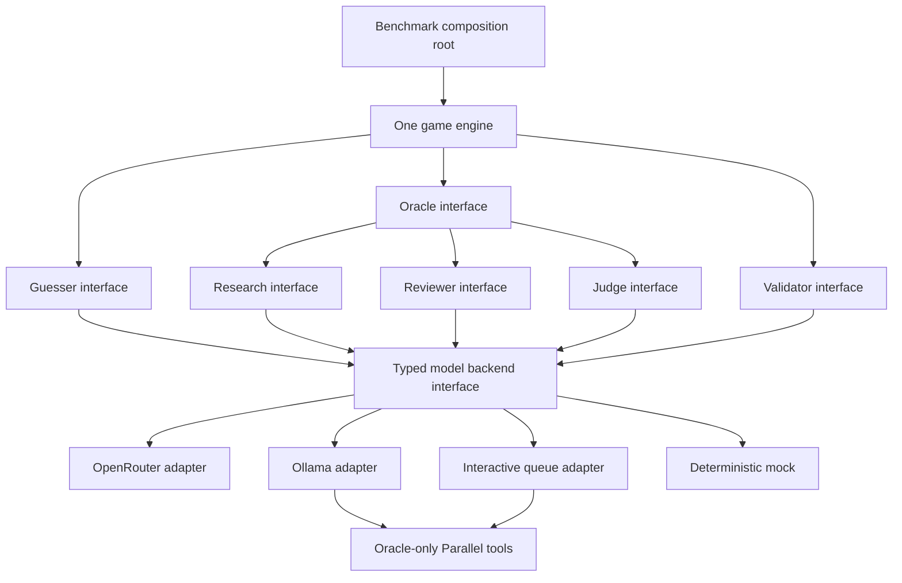

# Edition 1.2 DRAFT: configurable role backends

Edition 1.2 uses the main benchmark scheduler, game engine, adjudication rules, artifacts,
repair flow and reporting. It is inactive, local and explicitly selected. Edition 1.1 remains
the default public edition. The shared registry is `config/editions.yaml`.

The implementation separates two boundaries:



Role services own prompts, validation and adjudication. Transport adapters own provider wire
formats, capabilities and observations. The composition root owns files, credentials,
spending and the work queue. Reviewer `approve_primary` is a separate control outcome in
the Reviewer interface; it does not generate a pretend model response.

## Select models and roles

`--model` selects the registered Guesser, including its model, route and settings. A runtime
YAML overrides any subset of `guesser`, `oracle`, `reviewer`, `judge` and `validator`.
Omitted roles inherit the benchmark defaults. A Guesser override must match its registered
model ID and gateway; changing backends requires a corresponding model registration.

Preview is offline and loads no credentials:

```sh
.venv/bin/deep20 benchmark preview B-0003 --model M-0001 --edition 1.2 \
  --runtime-config config/edition-1.2/interactive-oracle.yaml
```

Examples are in `config/edition-1.2/`: inherited OpenRouter defaults, a local Oracle, an
interactive Oracle, separate interactive infrastructure roles, and an entirely mocked run.
The local example contains a model-name placeholder. The adapter verifies `/api/tags` and
`/api/show`; it never pulls or substitutes a model. It checks the configured context against
model metadata and rejects requests above its conservative context bound before inference.
Installed model digests are recorded and must remain unchanged when resuming an execution.

After authorizing a live run and its total allowance:

```sh
.venv/bin/deep20 benchmark run B-0003 --model M-0001 --edition 1.2 \
  --runtime-config config/edition-1.2/interactive-oracle.yaml \
  --run-id BX-draft-example --benchmark-mode experimental --live --budget-usd 2
```

The amount above is an example cap, not an estimate that the whole run will fit. The default
is three iterations per subject. Add `--targets T-0001` for one subject. Full benchmarks
must use the detached `screen` and `caffeinate` procedure in the benchmark README.

Draft paid execution requires both `--live` and a positive `--budget-usd`. Local or
interactive Oracle research uses a separate paid service, even when inference is local.
Startup canaries use the selected adapters and the same allowance; `--no-canary` skips
inference probes but retains configuration, pricing and local capability checks. Mock
scripts are validated without consuming them. Interactive roles wait for their first real
work item instead of launching an operator conversation during startup.

Use `repair` with the same model, edition, runtime file, execution ID and allowance. Changed
runtime bindings require a new execution. Work from earlier trial attempts is cancelled;
failed and uncertain charges remain in the original spending ledger.

## Mock every role

Mocks are deterministic simulations that return normal typed role results. Every role
supports `behavior: fixed` and `behavior: script`; scripts restart for each episode and
fail explicitly on exhaustion. They do not fall back to a real provider.

```yaml
roles:
  reviewer:
    implementation: mock
    behavior: approve_primary
  validator:
    implementation: mock
    behavior: fixed
    response:
      answer: "YES"
      explanation: "Synthetic acceptance for this simulation."
```

`approve_primary` preserves the Oracle's actual directional token, including RATHER_YES
or RATHER_NO. Its decision path is `review_bypassed`; it creates no Reviewer verdict,
provider trace, agreement or billable request. A fixed YES Reviewer is a different
simulation: it can disagree with a RATHER_YES Oracle and invoke the configured Judge.
Oracle UNKNOWN remains final under the normal rules.

An execution containing any configured mock is synthetic, even if that role is never
invoked. It is excluded from scoring, publication and factual answer reuse. Reports keep
simulated outcomes separate from eligible benchmark results and record zero mock inference,
tokens and searches. This makes mocks useful for wiring checks and intentionally saving
support calls without making a claim about model performance.

The following command makes no provider or research calls:

```sh
.venv/bin/deep20 benchmark run B-0003 --edition 1.2 --model M-9900 \
  --models-path config/edition-1.2/mock-models.yaml \
  --runtime-config config/edition-1.2/all-mock.yaml \
  --run-id BX-all-mock-example --benchmark-mode experimental --targets T-0001
```

## Interactive communication

The benchmark writes a private, durable SQLite request and waits. A controller claims it,
delivers only its role projection to a worker, and submits the raw response. Codex or a human
can be that worker. The benchmark does not call a desktop conversation API, start a Codex
task, or assume access to a model's hidden reasoning. MCP is a possible later transport
over the same queue contract; this draft implements the CLI transport.

```sh
.venv/bin/deep20 benchmark work --edition 1.2 --model M-0001 --run-id BX-draft-example list
.venv/bin/deep20 benchmark work --edition 1.2 --model M-0001 --run-id BX-draft-example \
  claim WQ-REQUEST_ID --operator oracle-worker --role oracle --output private/oracle-claim.json
.venv/bin/deep20 benchmark work --edition 1.2 --model M-0001 --run-id BX-draft-example \
  read --claim-file private/oracle-claim.json
.venv/bin/deep20 benchmark work --edition 1.2 --model M-0001 --run-id BX-draft-example \
  submit --claim-file private/oracle-claim.json --response-file private/oracle-response.json
```

`WQ-REQUEST_ID` stands for the full request ID returned by `list`. Claims bind role, operator,
request hash, lease and attempt. Leases can be renewed. Identical submissions are idempotent;
conflicting, expired and stale submissions are rejected. `status` reports waiting work;
`cancel` ends a pending item. Queue waiting is not an inference retry. Payloads are cleared
from consumed queue rows after the episode result is persisted; receipts and hashes remain.
SQLite database/WAL pages are private artifacts, not a guarantee of forensic erasure.

The controller keeps request IDs, claims, paths and operational metadata outside the worker
conversation. `read` exports only role messages and the response schema. A Guesser worker
must receive the messages alone in a fresh restricted context, without files, web tools or
other roles' conversations. Its binding requires `isolated_context: true` and a different
operator identity from privileged roles. That flag is a controller attestation, not an OS
sandbox. Running an unrestricted agent with access to `private/` does not establish Guesser
isolation. This Oracle-aware conversation must not also act as the Guesser.

Reviewer and Judge workers receive only subject, current question and numbered evidence.
They must use separate blind contexts, with no Oracle answer or web access. Validator gets
only subject and current guess. Invalid Guesser text is submitted unchanged and reaches the
engine's counted FORMAT_ERROR path; the queue never offers a free semantic correction.

## Managed research and spending

Only an Oracle claim can call the managed tools:

```sh
.venv/bin/deep20 benchmark work --edition 1.2 --model M-0001 --run-id BX-draft-example \
  search --claim-file private/oracle-claim.json \
  --objective "The current factual question" --query "focused search query"
.venv/bin/deep20 benchmark work --edition 1.2 --model M-0001 --run-id BX-draft-example \
  fetch --claim-file private/oracle-claim.json \
  --objective "Evidence for the current question" --url https://example.org/page
```

Parallel uses `PARALLEL_API_KEY`, then ignored `private/parallel.yml` or `.yaml` with
`api.api_key`. OpenRouter continues using `OPENROUTER_API_KEY` and its separate private
credential file. Keep these files owner-only. Keys never enter runtime snapshots, audits,
hashes or console output. No Parallel live verification is implied by offline tests.

Search and Extract use the native v1 APIs. Each fetch contains one URL. Requests and
responses have bounded queries, excerpts, searches, fetches, rounds and deadlines. Local
Oracle tool calls run through a request-scoped loop, followed by a schema-constrained final
pass. External search sessions are not reused. Tool failure, exhaustion or unresolved
research is infrastructure failure, never an invented factual answer.

The SQLite spending ledger reserves a conservative upper bound before every paid HTTP
request. It covers SDK retries, canaries, research and operator processes. Reported billing
settles the reservation; unknown or failed billing retains it across restarts. Parallel USD
billing is currently unreported, so those reservations remain held. Bounds are versioned
configuration, not claims about actual prices or savings. A request whose bound exceeds the
remaining allowance is rejected before transmission, even if typical use would be cheaper.

The local model's hardware cost and an operator's time or subscription cost are unmetered.
They remain unknown rather than zero. The allowance caps paid service requests made through
the benchmark; it cannot meter an operator's independent spending outside those interfaces.

## Identity, caching and artifacts

Edition selection is part of execution identity, not a display label. Runtime snapshots and
definition hashes include the role bindings and research workflow. Prompt-cache namespaces
include the edition and that role's binding. The Guesser namespace does not incorporate
privileged role settings. Factual answer contracts include the adjudication configuration.
Changing an override cannot silently resume a differently configured execution.

OpenRouter retains its existing prompt-prefix policy. Ollama caching is unmeasured; mock
caching is unnecessary and interactive inference caching is unavailable to the benchmark.
No adapter adds response caching. Synthetic and interactive runs disable factual answer
reuse. Runs with an unpinned local model also disable it: specify `model_digest` for every
local binding before opting into reuse. The adapter verifies that digest against installed
metadata, and the pinned value enters the contract hash. Automated reuse remains governed by the existing fully adjudicated ASK policies and
compatible contracts. Edition separation prevents old-edition answers from entering draft
requests; it does not itself prove that two draft configurations are compatible.

Draft artifacts live under `private/editions/1.2/runs/<model>/<execution>/`. Manifest,
trial manifest, full benchmark result and summary use version 4. Legacy paths keep version
3 and their existing payloads and hashes. Backend observations are versioned optional fields
in role audits. The private `draft-report.json` is a signed, allowlisted post-run projection;
`spending-summary.json` covers the entire allowance, including failed and superseded work.

The independent publisher can render a local preview without reading execution modules:

```sh
source/publication/compiler/.venv/bin/deep20-publication preview-draft \
  --edition 1.2 --model M-9900 --run-id BX-all-mock-example
```

The preview stays under `private/editions/1.2/previews/`. Ordinary publication validates the
released entries against the shared registry, omits draft runs, and keeps the existing
1.0/1.1 selector and v9 compatibility download. Activating 1.2 requires a separate release
decision, publication contract and qualification checks.

## Migration and verification

New experiments use `deep20 benchmark` with configuration overrides. The scripts under
`documentation/analysis/codex-as-oracle/src/` remain compatibility entry points for their
saved experiments; existing run IDs, artifacts and active processes are not migrated in place.
They are not required for new models or new draft runs. A historical shared-conversation
experiment cannot acquire blind-review provenance by moving its files into the new format.

Normal tests and builds remain offline. Recorded HTTP fixtures cover the backend contracts;
queue, ledger, scheduler and isolation tests cover execution behavior. Live canaries need
explicit authorization and an allowance. Local Ollama and Parallel require environment
verification before drawing conclusions about a particular installed model or live service.

Provider references checked for this draft: [Ollama chat](https://docs.ollama.com/api/chat),
[Ollama tool calling](https://docs.ollama.com/capabilities/tool-calling),
[Parallel Search](https://docs.parallel.ai/api-reference/search/search),
[Parallel Extract](https://docs.parallel.ai/api-reference/extract/extract), and
[OpenRouter server tools](https://openrouter.ai/docs/guides/features/server-tools/web-search).
