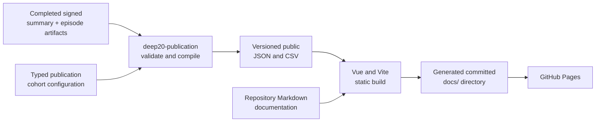

# Homepage creation and publication concept

Status: implemented official-only publication architecture with latest-qualified-run selection.

## Purpose

Deep20Bench should publish a static GitHub Pages website derived from completed benchmark
artifacts. The site should be useful both as an approachable leaderboard and as an
evidence-first research explorer. It must show a clearly defined winner without hiding success
rates, subject-level variation, costs, provenance, or experimental results.

The website is a post-processing product. It never participates in a benchmark execution and
must not become a source of Guesser context, session state, cache state, or retry input.

The durable benchmark artifacts remain the source evidence. Generated website data and HTML are
reproducible projections of that evidence, not a second benchmark result store.

## Dedicated package boundary

Homepage preparation must be owned by a dedicated, independently testable package rather than
being added to the benchmark runner or reporting module.

The package is:

```text
source/publication/
├── compiler/
│   ├── pyproject.toml
│   ├── src/deep20_publication/
│   └── tests/
└── site/
    ├── package.json
    ├── vite.config.ts
    └── src/

config/publication.yml
```

`deep20-publication` is a Python package and command-line composition root. Python is preferred
for the source compiler because the benchmark artifacts already use strict Pydantic models,
YAML envelopes, integrity hashes, and `Decimal` metrics. The package owns:

- Discovery and validation of publishable summary artifacts.
- Integrity verification and schema-version handling.
- Official-cohort matching and newest-qualified-run selection.
- Curated official leaderboard scoring.
- Construction of a strict, versioned public dataset.
- Deterministic JSON and CSV serialization.
- Invocation of the separately packaged static-site build.

The package does not depend on or import benchmark execution, game, Oracle, provider,
credential, prompt, or session implementations. Shared publication-facing artifact contracts
may later move into a small dependency-neutral contracts package used by both the benchmark
producer and publication consumer:

```text
deep20-benchmark ──────► deep20-artifact-contracts
deep20-publication ────► deep20-artifact-contracts
deep20-site ───────────► generated public JSON only
```

This avoids making `deep20-publication` transitively depend on OpenRouter or other live
execution code. The contracts package contains only strict frozen types, identifiers,
publication summary schemas, canonical serialization, and integrity-verification primitives.
It contains no filesystem policy or provider behavior.

The publication core operates only on typed source objects and returns typed dataset objects.
Filesystem discovery and output paths belong to the publication CLI composition root, while
output persistence is represented by an injected typed sink. This preserves the project rule
that reusable libraries do not select paths or open artifacts themselves.

The frontend is a second explicit package nested under the publication boundary:

```text
source/publication/site/
├── package.json
├── vite.config.ts
└── src/
```

It uses Vue, TypeScript, Vite, and Apache ECharts. It does not parse benchmark YAML, reproduce
Python scoring, or decide whether a run is official. It renders only the versioned public JSON
contract produced by `deep20-publication`.

## One-way publication pipeline



The intended local command is:

```bash
uv run --project source/publication/compiler deep20-publication build
```

It must not require `OPENROUTER_API_KEY` or any file under `private/`. It must not make network
requests or run missing benchmarks implicitly. Running a paid benchmark and publishing finished
artifacts remain separate explicit commands.

The CLI also accepts repeatable exact `--exclude-run-dir runs/M-…/BX-…` options for intentional,
one-build curation. Exclusions are explicit presentation inputs: paths must resolve to existing
run directories under `runs/`; the success log records their count, and the public provenance
records the exact relative paths. They never change or delete source artifacts.

An additional verification mode rebuilds into a temporary directory and checks the committed
site without replacing it:

```bash
uv run --project source/publication/compiler deep20-publication build --check
```

## Source artifact contract

The current single-model summary is validated as the signed schema-version-3 contract emitted
by the benchmark. The publication package owns a strict frozen read model for that exact
contract and rejects other shapes or versions. It does not carry a heuristic legacy adapter.
If the benchmark summary changes meaning, it must advance the schema version before the
publisher adds a new explicit reader.

The compact summary must be self-contained for publication and include:

- Execution, benchmark, model, and subject identifiers.
- Model display metadata and immutable configuration hash.
- Benchmark definition and selected-subject catalog hashes.
- Base seed, iterations, question limit, and policy version.
- Start and completion timestamps.
- Source Git commit.
- Complete/publication/infrastructure outcome flags.
- Aggregate counts and distributions.
- Subject aggregates and concise typed trial outcomes.
- References and integrity hashes for adjacent public artifacts.

The publication compiler validates the signed envelope before using any values. It fails on
tampering, duplicate identities, inconsistent counts, missing required provenance, unsafe
paths, or an unsupported schema. It never derives comparison eligibility from filenames,
filesystem timestamps, or display names.

For every completed trial, the publisher follows the summary's typed `trial_result` reference
and validates both the referenced file hash and the signed episode envelope. The episode read
model is also strict and versioned. It supplies the subject context, typed `ASK` and `GUESS`
actions, final adjudicated answer tokens, model-reported Oracle evidence, final Validator
adjudication, resolved component versions, and aggregate cost/token/cache/latency telemetry.
An episode identity must match its compact trial identity before it enters the public
projection.

The active publisher accepts protocol 9. Its read model validates Reviewer and Judge decision
bases while the public projection continues to treat the final quality-controlled token as
authoritative and label the research Oracle's excerpts as model-reported. Blind Reviewer and
Judge decisions remain outside the public episode projection.

## Automatic discovery and explicit cohorts

Runs are auto-discovered from the canonical run hierarchy. There is no hand-maintained list of
published execution IDs.

Auto-discovery does not decide which run happens to become the homepage. A typed publication
configuration defines the active leaderboard cohort. It fixes:

- Cohort ID and display name.
- Selected subject set and required iteration count.
- Score policy version.
- Included model IDs.
- Whether it is the active homepage cohort.

A run enters an official cohort only when it:

- Passes all integrity checks.
- Is terminal.
- Contains exactly the active subject set.
- Contains every required completed trial number exactly once for each subject.

A completed model-attributable failure is a completed scored trial. An infrastructure-failed or
missing trial is not; it must be supplied by the execution retry before publication. There is no
four-of-five fallback or trial sampling. Qualification deliberately does not compare historical
benchmark version, seed, question limit, subject-catalog hash, publication-eligibility flags, or
model configuration against current catalog values. Model metadata is projected from the
selected signed run.

If several official executions are complete for the same model, the leaderboard uses the one
with the greatest typed `completed_at` value. It never chooses the best-scoring execution. Only
that selected execution is published for the model. Older complete executions and valid
non-qualifying runs remain in the durable source archive but are omitted from the public
projection. Models without a complete run are omitted from the result set. A timestamp tie is
an error rather than an implicit filename-based choice, and invalid or tampered discovered
artifacts fail the build.

## Winner and scoring rule

The homepage winner is the model with the lowest question score in the active official cohort.
The headline number stays in the same unit as the game: questions. Lower is better.

For a benchmark with question limit `Q`:

```text
failure penalty = Q + 1
trial value = counted questions when successful, otherwise failure penalty
subject value = average of all trial values for that subject
model score = average of all subject averages
```

This calculation:

- Uses exact `Decimal` arithmetic.
- Gives every subject equal weight.
- Gives every completed trial equal weight within its subject.
- Ensures every failed trial affects the score.
- Treats protocol failures and early Validator `UNKNOWN` results as failures rather than
  artificially cheap trials.
- Produces an exact tie when unrounded scores are equal.

The overview displays the question score to one decimal place and ranks on the exact unrounded
value. Detailed run and subject views show the model score and subject averages. Episode views
show both counted questions and penalized questions. A model failure shows both its observed
count and the declared penalty so 51 is never mistaken for an observed question count.

Every score presentation states that lower is better. Model failures and unavailable
infrastructure results also have explicit text states. Text, position on a linear scale, and
texture repeat the meaning so color is never the only cue. The score explanation uses a
focusable disclosure that works by click, keyboard, or tap; mobile does not depend on hover.

The winner never appears without adjacent success rate, trial and subject counts, and a link to
the scoring explanation. Cost is a separate comparison and may support a separate “best value”
label; it is not a hidden tie-breaker. Recorded historical cost and dated catalog pricing must
remain distinguishable.

Version 5 shows the model question score beside subject averages and individual trial values
instead of adding a fragile confidence interval. It does not remove outliers or create a
cohort-relative composite score.

## Public website

The site is a focused static Vue publication with route entry shells:

- Homepage with question-score winner, leaderboard, methodology summary, and limitations.
- A dedicated Story & prior work page that records the benchmark's human origin, credits its
  makers, and links directly to the research lineage it belongs to.
- Explorer with score comparison, subject-by-model heatmap, raw trial spread, and cost
  trade-offs.
- Selected-model metadata with the current official result and per-subject results.
- One official run detail tree per selected model.
- A static drill-down from an execution to its subjects and then to every completed episode.
- An episode transcript headed by the disclosed hidden subject (for example, “Finding
  Garfield”), so the reader never loses the context of what the model was trying to identify.
- Question-by-question typed actions beside the exact final `YES`, `NO`, or `UNKNOWN` token
  returned by the factual-adjudication pipeline or Validator.
- Expandable Oracle trails containing the reported source URL and excerpt for each adjudicated
  question, with an explicit warning that this evidence is model-reported rather than
  independently certified.
- A technical panel with requested and resolved component models/providers, reasoning effort,
  prompt-contract versions, call and token counts, cache reads/writes, latency, recorded cost,
  timestamps, and immutable episode/run identifiers.
- Methodology, Guesser isolation, reproducibility, citation, licensing, and downloadable-data
  pages.
- Rendered engineering documentation.

Vue renders tables and explanations from the generated static JSON. Apache ECharts adds
responsive SVG charts and tooltips. Every chart has an ARIA description and equivalent
structured text or table data; meaning never depends on color or pointer hover alone.

The story page must distinguish an independent origin from a priority claim. Deep20Bench began
with Patrick Heusser and Markus Tuor developing the initial idea together while playing Twenty
Questions on holiday with their children. The real-world game exposed the useful combination
of broad world knowledge and efficient question-planning. Patrick later designed and vibe-coded
the resulting benchmark.

Prior work is not buried in a generic bibliography. The closest published predecessor receives
prominent treatment: Apple researchers Yizhe Zhang, Jiarui Lu, and Navdeep Jaitly's
Entity-Deduction Arena work on multi-turn planning through hidden-entity games. The page also
curates earlier and later work on overlap-free Twenty Questions evaluation, learned questioning
strategies, adaptive elicitation, and Bayesian experimental design. Each item links to its
primary research or publication page, explains the relevant overlap in plain language, and avoids
claiming that Deep20Bench was first. Deep20Bench's own emphasis is stated as a scope distinction:
black-box comparison, strict Guesser isolation, repeated subject-balanced trials,
evidence-bearing adjudication, and inspectable public provenance.

The compiler emits an allowlisted public dataset. The detailed projection may contain only
post-run subject context, typed actions, protocol answer tokens, Validator explanations,
model-reported Oracle evidence URLs and excerpts, aggregate component telemetry, public model
version metadata, and immutable artifact identities.

It must not contain rendered prompts, system instructions, the serialized Guesser conversation,
the opaque variation token, aliases, raw model/provider responses, call identifiers, provider
traces, session identifiers, prompt-cache keys, diagnostics, credentials, headers, environment
values, or other private execution state. This is deliberately a typed reconstruction rather
than a dump of internal logs.

The detail compiler is one-way and post-run. Neither its public JSON nor any generated page may
be reused as Guesser conversational state, cache input, retry input, or provider metadata. Tests
walk the complete generated JSON keyspace for forbidden fields and assert that every published
turn comes from the typed episode projection.

## Repository and GitHub Pages layout

Handwritten Markdown lives in `documentation/`; `docs/` is reserved for generated GitHub Pages
output. All new publisher source code remains inside the single dedicated publication boundary:

```text
source/publication/  independent compiler and site source
config/              benchmark and publication configuration
documentation/       handwritten Markdown source
docs/                generated GitHub Pages output only
```

The local build replaces `docs/` atomically after every validation and rendering stage
succeeds. The directory includes `index.html`, static assets, public data downloads, `.nojekyll`,
and no source secrets.

Public JSON is written to a temporary Vite public directory during the build. It is not retained
under `source/publication/site/`. The development server reads committed public data from
`docs/`.

The Vite build uses the configured GitHub Pages base path. The publisher then writes static
entry shells for every run, subject, episode, and result route so direct navigation and refresh
work under GitHub Pages. Local verification uses an HTTP origin because the Vue application
loads route data with `fetch`; opening `docs/index.html` directly explains how to start the
preview server.

GitHub Pages is configured to publish from `main` and `/docs`. Pushing the reviewed generated
directory is the publication approval. GitHub does not run the benchmark or regenerate the
site. A keyless CI job may run tests and `publication build --check`, but it does not need a
deployment workflow for this branch-folder arrangement.

Generated output must be deterministic:

- Python and Node dependencies are pinned in lockfiles.
- Records and pages use explicit stable ordering.
- No wall-clock build timestamp enters output.
- The same inputs produce byte-identical public datasets.
- Rebuilding an approved site produces no Git diff.

## Guesser isolation and caching

Publication occurs only after all relevant model calls. Its dependency direction is one-way,
from durable results to public output.

The benchmark runner never imports the publication package, reads `docs/`, reads generated
JSON, or uses site state for sessions, retries, prompt caches, application caches, scoring, or
report generation. Publication caches and frontend build artifacts are never placed in a
provider cache namespace.

The publication feature is not LLM-backed. Provider prompt caching and application response
caching are therefore not applicable. The compiler recomputes its typed projection from source
artifacts on every build.

Console output follows the repository logging policy: one timestamped concise result for a
successful publication build and one stable failure record with no private artifact contents.

## Verification

Implemented Python tests cover:

- Strict parsing of the signed current protocol-v6 manifest contract and rejection of retired
  protocol versions.
- Duplicate-key and integrity-tampering rejection.
- Full completed-trial qualification and latest-qualified-run selection invariants.
- Penalized failures, average aggregation, infrastructure `N/A`, and exact joint ranking ties.
- Deterministic public JSON.
- A public-field allowlist regression check.
- A dependency-boundary check proving the package does not import benchmark, game, Oracle,
  Reviewer, Judge, or OpenRouter execution code.

The static build performs strict Vue and TypeScript checks. Browser validation covers:

- Base-path-safe links for the `/deep-20-bench/` project site.
- Generated routes, data downloads, and internal navigation.
- Desktop and mobile layouts.
- Data-backed tables and responsive SVG charts.
- Keyboard navigation and accessible chart descriptions.

The isolation boundary is enforced structurally: the benchmark runner never imports or invokes
the publisher, and the publisher has no execution-component dependency. Existing game isolation
tests remain the authority for the Guesser-visible request projection.

## Licensing, citation, and future holdouts

Published result data and documentation use CC BY 4.0 so they may be reused, including
commercially, with attribution. The repository provides a precise attribution statement and
`CITATION.cff`.

Project-owned Python and TypeScript code use PolyForm Noncommercial 1.0.0. The project is
described as **source-available**, not OSI open source. Commercial use of the code requires
separate permission. The exact scope and notices should receive legal review before the first
public release.

The first website release covers the transparent public-core cohort. Future private or rotating
holdout subjects remain outside the public repository, publication inputs, and generated site
until they are retired. Publishing a holdout retires it from future secret evaluation.

## References

- [GitHub Pages publishing sources](https://docs.github.com/en/pages/getting-started-with-github-pages/configuring-a-publishing-source-for-your-github-pages-site)
- [Vue](https://vuejs.org/guide/quick-start.html)
- [Vite static deployment](https://vite.dev/guide/static-deploy.html)
- [Apache ECharts ARIA guidance](https://echarts.apache.org/handbook/en/best-practices/aria/)
- [PolyForm Noncommercial 1.0.0](https://polyformproject.org/licenses/noncommercial/1.0.0)
- [Creative Commons Attribution 4.0](https://creativecommons.org/licenses/by/4.0/)
