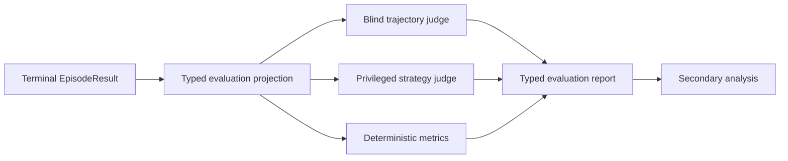

# Post-hoc conversation evaluation

Status: concept only. This document does not define part of the official Deep20Bench score.

## Motivation

The terminal outcome and question count do not describe the quality of a Guesser's trajectory.
A model may succeed through a lucky early guess, reach the right answer inefficiently, follow a
strong strategy but narrowly fail, repeat questions, forget earlier answers, or become visibly
lost.

An independent LLM can review a completed episode and describe those behavioral qualities. This
would complement deterministic benchmark metrics; it would not replace the Oracle, Reviewer,
quality-control Judge, Guess Validator, or primary score.

Terminology matters: the implemented Oracle quality-control **Judge** resolves one disputed
factual answer during gameplay. The proposed **trajectory judge** in this document evaluates a
completed Guesser strategy after gameplay. They are different roles with different prompts,
inputs, sessions, cache namespaces, outputs, and effects.

The evaluator observes actions, not hidden reasoning. It can infer that a trajectory appears
incoherent from the questions and guesses, but it cannot establish the Guesser's actual internal
belief state. Evaluations and counterfactual suggestions must therefore include confidence and
remain explicitly interpretive.

## Goals and non-goals

The evaluation should:

- Assess whether individual questions are clear, relevant, and likely to distinguish candidates.
- Assess whether the Guesser uses the accumulated `YES`, `NO`, and `UNKNOWN` answers coherently.
- Detect repetition, contradictions, stalled narrowing, premature guesses, and poor recovery.
- Separate strategy quality from the terminal outcome.
- Produce structured per-turn findings and aggregate scores that can be compared across episodes.
- Preserve enough provenance to reproduce the evaluation and measure judge disagreement.

The first version should not:

- Change gameplay, adjudication, question counting, the primary benchmark score, or publication
  eligibility.
- Claim access to the Guesser's hidden reasoning or a complete candidate set.
- Treat one judge's numerical rating as objective ground truth.
- Feed evaluator output back into the Guesser or use it to adapt a running episode.
- Rank models by a composite LLM-judge score before reliability has been established.

## Evaluation perspectives

Two separate perspectives answer different questions and should never be collapsed into one
opaque rating.

| Perspective | Input | What it can assess |
| --- | --- | --- |
| Blind trajectory judge | The exact `guesser_conversation`, including the fixed instructions, `BEGIN`, structured actions, and answer tokens | Clarity, use of visible history, repetition, contradictions, apparent narrowing, recovery, and whether the Guesser appears lost |
| Privileged strategy judge | The trusted subject, resolved `turns`, terminal outcome, and the same visible conversation | Whether questions were useful for this subject, whether deductions were directionally sound, guess timing, trajectory efficiency, and plausible better actions |

The blind trajectory judge must not receive the subject identity, outcome, model name, provider,
costs, Oracle evidence, Oracle/Reviewer/quality-control-Judge decisions, Validator explanation,
or other privileged metadata. This reduces outcome and brand bias and makes its assessment match
what could be inferred from the Guesser-visible interaction alone.

The privileged trajectory judge may see the trusted subject and adjudicated turns only after
the episode is terminal. Oracle evidence, internal Reviewer/Judge decisions, and Validator
explanations should remain excluded initially: the evaluation is of Guesser behavior against
the final adjudicated game, not a second review of the adjudicators' private reasoning.

## Input representation

`EpisodeResult` is the authoritative source. The evaluator integration should construct a
strict, versioned projection from its typed fields rather than scrape Markdown, console output,
or raw component audits.

Text is an appropriate model-facing representation when it is rendered canonically from that
projection. It preserves the observable sequence needed for behavioral evaluation, but it does
not create access to latent beliefs. Structured turn numbers, action types, answer tokens, and
terminal state should accompany the rendered text so formatting cannot blur the protocol.

A blind evaluation requires a populated `guesser_conversation`. If it was disabled for the
episode, the blind evaluation is unavailable; it must not be reconstructed from privileged call
audits. A privileged evaluation may use the resolved `turns`, but its result must record which
input fields were available.

## Proposed rubric

Use anchored ordinal scores rather than unconstrained percentages. Each score should include a
short rationale and confidence value.

| Dimension | Low score | High score |
| --- | --- | --- |
| Question clarity | Ambiguous, compound, or not answerable as a property question | Clear, atomic, and answerable with the game protocol |
| Discriminative value | Unlikely to narrow plausible candidates | Likely to divide or sharply narrow plausible candidates |
| History use | Ignores, repeats, or contradicts visible answers | Builds consistently on all relevant prior answers |
| Trajectory progress | Stalls or changes direction without support | Moves from broad distinctions toward a defensible identity |
| Recovery | Mishandles `UNKNOWN`, rejection, or an unhelpful branch | Adjusts strategy without discarding valid earlier information |
| Guess timing | Guesses without support or delays after strong identification | Guesses when the accumulated evidence makes it reasonable |
| Coherence | The sequence appears fragmented or lost | The sequence reflects a stable, intelligible strategy |

Per-turn assessment should classify the action with a small strategy taxonomy, for example:

- Broad category or taxonomy split.
- Time, geography, domain, role, or property narrowing.
- Hypothesis test.
- Direct guess.
- Confirmation of an already implied identity.
- Repetition or semantic near-duplicate.
- Contradiction with established answers.
- Recovery or strategic reset.

The evaluator may propose one better next action for selected low-scoring turns. Such
counterfactuals are diagnostic examples, not proof that the alternative would have produced a
better outcome.

Aggregate reporting should keep these concepts separate:

- Blind process quality: coherence visible without knowing the answer.
- Privileged strategy quality: usefulness relative to the trusted subject.
- Outcome and deterministic efficiency: existing success and question-count facts.
- Judge confidence and agreement: uncertainty in the evaluation itself.

## Typed result concept

Any implementation must expose strict, frozen Pydantic models rather than dictionaries or
ad-hoc tuples. A versioned evaluation result should contain:

- Evaluation ID, episode ID, rubric version, perspective, and creation time.
- Exact evaluator configuration and resolved model/provider route.
- A digest of the typed input projection.
- Per-turn strategy labels, dimension scores, confidence, and concise rationale.
- Aggregate dimension scores and confidence.
- The first turn where the trajectory materially deteriorated, when applicable.
- Zero or more controlled failure-mode labels.
- Optional counterfactual actions tied to specific turns.
- Token, prompt-cache, latency, and cost metrics.
- A terminal success or typed failure variant.

Blind and privileged inputs should be different concrete types. The perspective must be a
discriminator so a blind request cannot accidentally accept privileged fields.

## Deterministic companion metrics

LLM ratings are more useful when shown beside metrics that do not require a judge:

- Exact and normalized question repetition rate.
- `UNKNOWN` rate and behavior immediately following `UNKNOWN`.
- Ask, guess, and rejected-guess counts.
- Number of turns between successive guesses.
- Direct contradictions that can be derived from normalized repeated propositions.
- Turns used before the first sustained narrowing phase, when a deterministic classifier can
  define that phase reliably.

Semantic duplication, information value, and inferred belief consistency should remain
judge-labelled unless a separately validated deterministic method exists.

## Isolation and data flow

Evaluation is a post-processing branch from a completed result:

There is deliberately no path from the evaluation report back to the game engine or Guesser.
Evaluation may run only after all model calls for the relevant episode are complete.

Evaluator requests, outputs, rationales, inferred identities, suggested questions, errors,
sessions, and cache namespaces must never:

- Enter a later Guesser request or visible message.
- Be stored in a Guesser prompt-cache or response-cache namespace.
- Affect Oracle, Reviewer, quality-control Judge, or Guess Validator inputs.
- Change retries, adjudication, scoring, or publication eligibility.
- Become shared conversational state across episodes.

The evaluator library should return typed results and persist only through an injected typed
sink. The benchmark composition root owns artifact paths and report integration. Benchmark mode
must not regain discarded raw call records merely to support evaluation.

## Judge reliability and bias

Before publishing judge-derived comparisons, run a preregistered pilot over a stratified sample
of successful, unsuccessful, short, long, and `UNKNOWN`-heavy episodes.

The pilot should measure:

- Agreement between at least two independently configured judges.
- Repeatability of the same judge on identical typed input.
- Sensitivity to semantically irrelevant transcript formatting.
- Agreement with a small human-annotated calibration set.
- Correlation with success and question count without treating either as the target label.
- Self-preference or family-preference effects when judge and Guesser models are related.

Rubric version, judge configuration, input projection version, and sampling settings must be
frozen in every reported comparison. Low agreement should be reported as a result, not hidden by
averaging.

## Caching decision

The stable evaluator instructions, rubric, output schema, and tool definitions should precede
the variable episode projection so provider-side prefix caching remains measurable. Blind and
privileged perspectives require separate session and prompt-cache namespaces, and all evaluator
namespaces must be isolated from every gameplay component.

OpenRouter response caching and application response caching should remain disabled. A stored
evaluation artifact is a result, not a reusable model-response cache. Do not pad evaluator
prompts or claim savings without measuring actual input tokens, cache reads and writes, cache
pricing, cost, and latency for the pinned route.

## Suggested rollout

1. Implement deterministic companion metrics and retain them as secondary analysis.
2. Add the blind judge and validate its repeatability without exposing results as rankings.
3. Add the privileged judge and compare agreement, bias, and usefulness against human review.
4. Publish per-episode evaluations only when their rubric and provenance are visible.
5. Consider aggregate model comparisons only after reliability thresholds are defined and met.
6. Consider any relationship to the official benchmark score as a separate, explicitly reviewed
   methodology change.
