# UX audit - 7 August 2026

This review covers every item in the supplied UX report against the current 12-model publication. Checks used a 1440 x 1000 desktop viewport and a 390 x 844 mobile viewport. The final implementation was also checked with keyboard-oriented UI tests and the generated static publication.

## Outcome

| Reported issue | Judgment | Result |
| --- | --- | --- |
| Nested scroll panes on public result pages | Real | Public result pages now use normal document scrolling. Run, subject, and episode workspaces keep their intentional pane layout. |
| Clipped workspace content has no continuation cue | Partly real | The report overstated the number of simultaneous episode scroll regions, but the clipping cue was weak. Scrollable workspace panes now have edge masks. |
| Cost chart starts at `$0.15` and ends with an irregular tick | Real | Horizontal bar charts now use a true zero baseline and normal ticks. |
| Score plot is compressed by Llama | Real visual tradeoff | Kept unchanged after review feedback. Llama remains in the shared 6-40 overview scale. A zero baseline would compress the main cohort further and is not required for a dot plot. |
| `100%` next to `1 violations` | Real | Breached values that would round to 100% now show `>99%`. Counts use `1 violation` and pluralize other values. |
| Story `20` watermark is clipped | Real | The watermark now stays inside the hero gutter. |
| Method contents strip has an empty eighth cell | Not reproduced | The remaining width is normal container space, not a generated cell. No change. |
| CI width is encoded three times | Valid concern | Kept after review feedback. The colored CI line, companion chart, and exact values remain. |
| Green, amber, and red bands imply thresholds | Valid concern | Kept after review feedback. The original colors and three groups remain, with the existing text that describes them as visual guides. |
| Cohort-relative band boundaries can move | Real behavior | Kept after review feedback. Tests continue to lock the intended three-band calculation. |
| Score values form a staircase | Real | Values now use an aligned column beside model names on desktop and mobile. |
| Companion CI plot looks unsorted | Real appearance | It intentionally follows score order so rows align. The plot now says `Rows follow question-score order`. |
| Blue score marker has no meaning | Not a defect | Blue consistently identifies the model-under-test score series. It remains unchanged. |
| Reviewer, Judge, and Validator cost slices are too small | Real | The main stack now shows Guesser, Primary Oracle, and Adjudication. The exact Reviewer, Judge, and Validator values remain available in the expandable breakdown and accessible text. |
| Ranking table header scrolls away | Real | Desktop ranking headers are sticky. Narrow layouts use result cards and avoid a nested horizontal table scroller. |
| Model and Run columns link to the same page | Real | The duplicate Run column is removed. The model link has one row-level chevron. |
| Claude Opus has unexplained emphasis | Not a defect | The observed state was the shared hover or keyboard-focus treatment. Baseline rows have no model-specific emphasis. |
| Cost labels mix run, Guesser, and model cost | Real | Labels now distinguish `Benchmark run cost` from `Guesser cost`. The overview total is correctly labeled `Total benchmark cost` at `$92.36`; total Guesser cost remains `$48.79`. |
| Per-episode money precision is inconsistent | Real | Comparable per-episode values now use four decimal places. Full-run totals keep two decimal places. The reported mixed percentage precision was not present in the current table. |
| Large hero dead space | Not reproduced | Current hero spacing is deliberate and consistent at both tested sizes. No change. |
| Score caption is orphaned | Not reproduced | The caption remains attached to its result section at both tested sizes. No change. |
| Results intro has a 200 px gap before its chart | Not reproduced | Current spacing follows the shared section rhythm. No change. |
| Data page has large empty color bands | Not reproduced | Current content fills those sections. No spacing change. |
| Result info links have no heading | Real | The rail now has a visible `Definitions` heading. |
| Info affordance is too weak | Partly real | Existing controls were already usable by keyboard and met the mobile touch target. Their size, opacity, and hover/focus treatment are now stronger. |
| Site footer is missing useful resources | Real | Public pages now share citation, result-license, source-license, contact, error-report, and repository links. Dates are human-readable, with exact values retained in `datetime`. The no-JavaScript home uses the same link source. |

## Score treatment retained by request

The overview still compares all models on one axis. Llama is not split into an inset. The original CI colors and three companion bands are also retained.

### Desktop

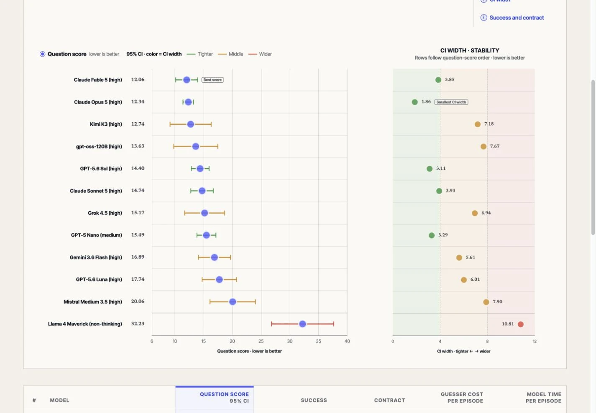

### Mobile

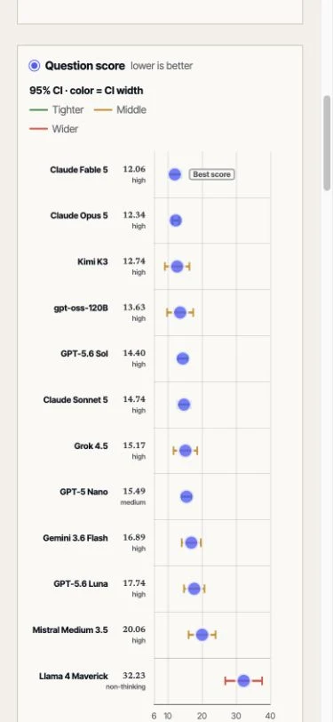

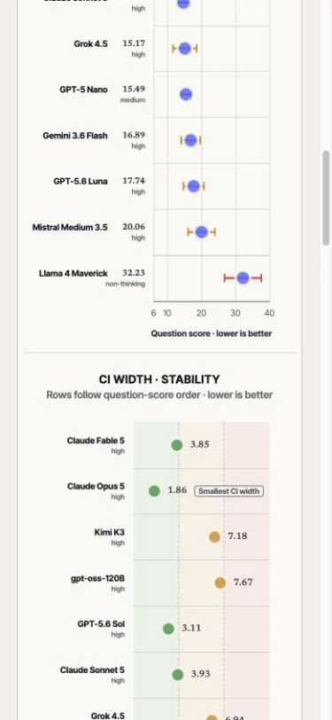

## Cost charts

The Guesser bar chart starts at `$0.00`. The component stack uses three readable segments while preserving the exact adjudication breakdown.

### Desktop

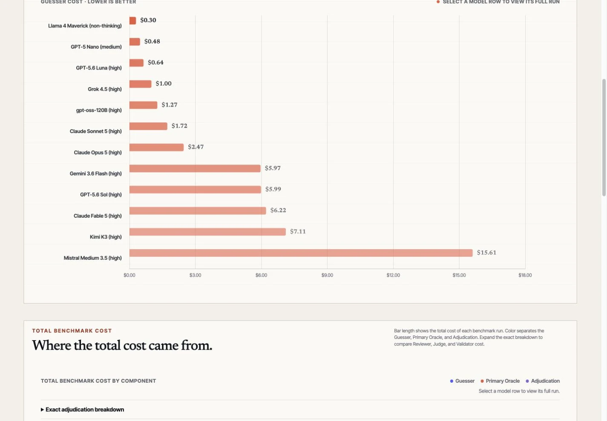

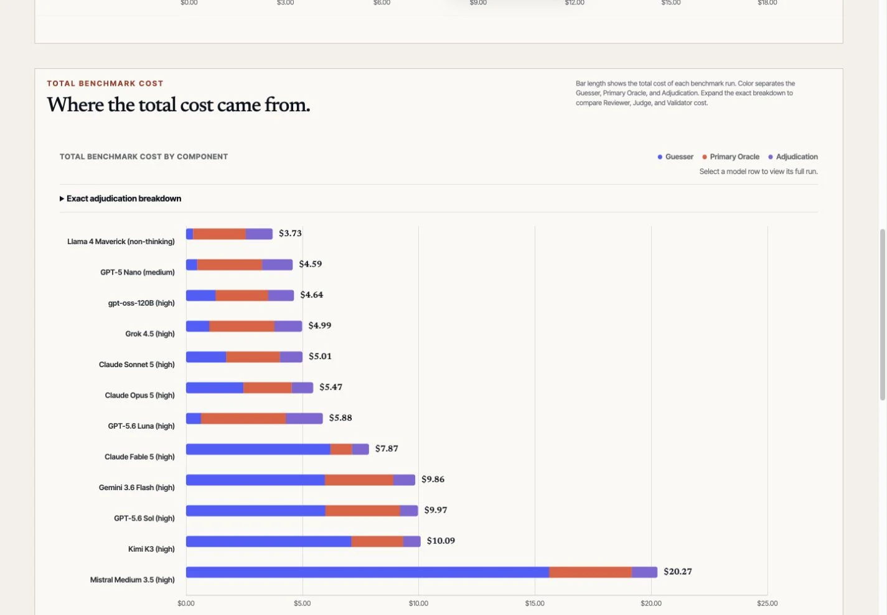

### Mobile

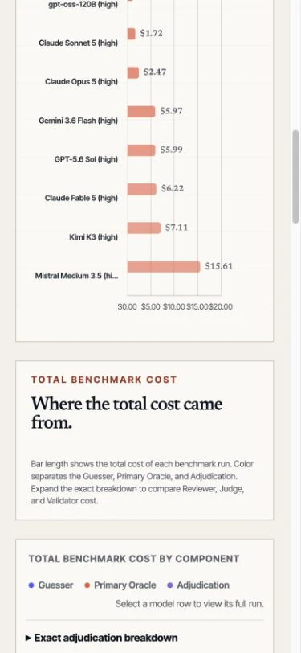

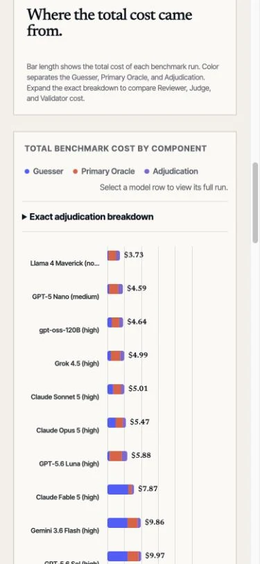

## Tables and site chrome

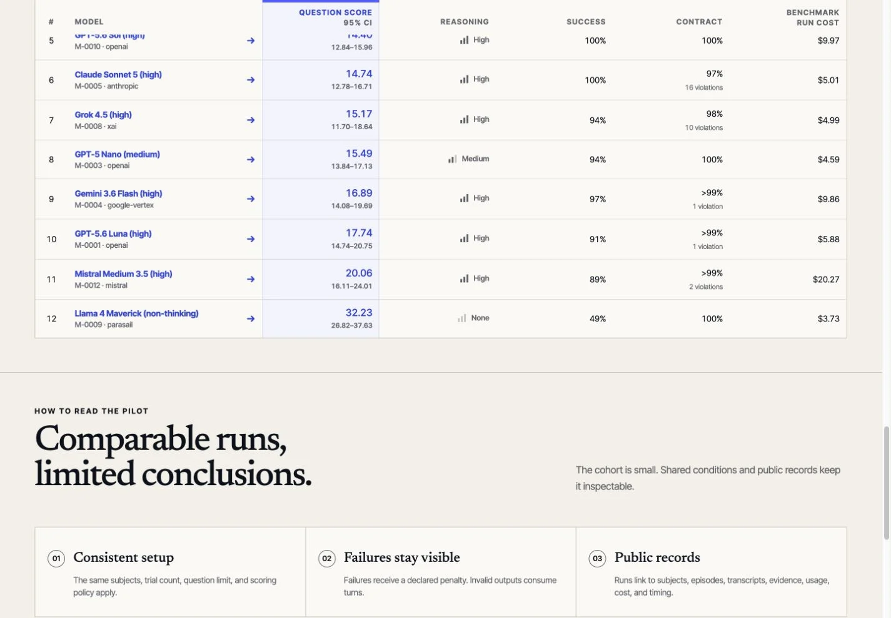

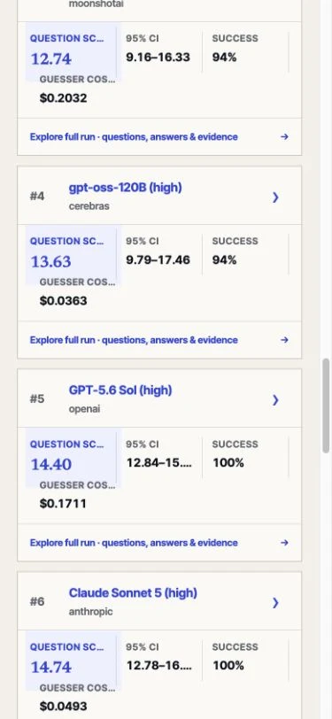

The same neutral action row is used at the wider collapsed-card breakpoint. Blue remains on the link text, chevron, selected metric, and hover or focus state.

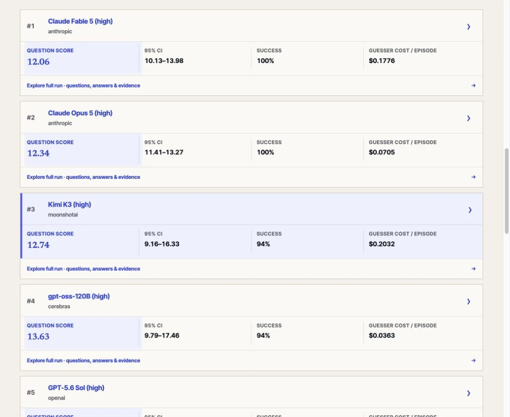

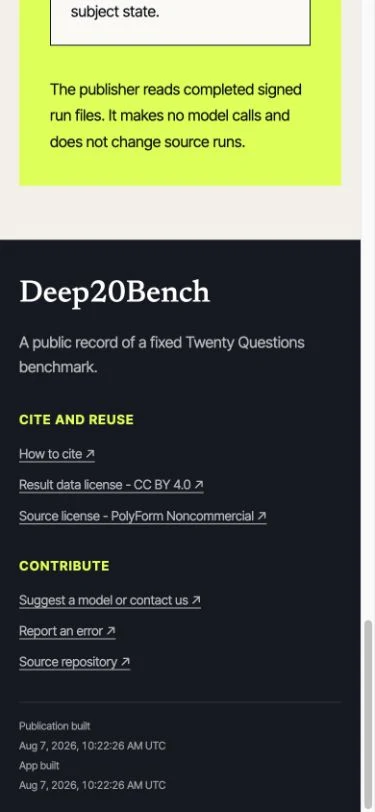

## Validation

- Site type checks: passed.
- Playwright UI suite: 77 passed, 9 intentionally skipped across desktop and mobile projects.
- Publication compiler and CLI tests: 47 passed.
- Generated publication consistency check: passed.
- Browser review: completed at 1440 x 1000 and 390 x 844.
- `docs/`: fully regenerated from the updated publication source.

These changes affect publication and report presentation only. They do not change prompts, Guesser-visible history, provider requests, sessions, caches, adjudication, scoring, or benchmark artifacts. Prompt caching is not involved, so its existing decision remains unchanged.
