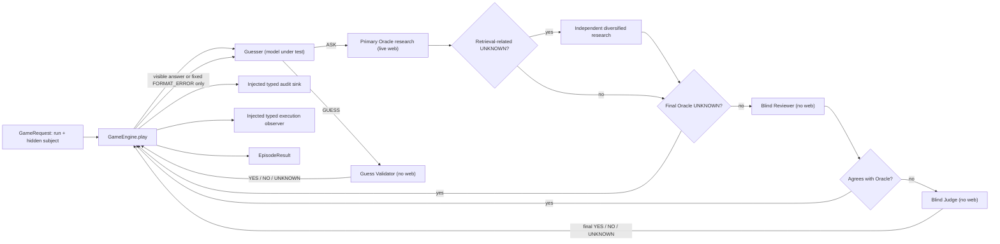

# Game engine concept

## Purpose and scope

The game engine is the deterministic state machine for one Deep20Bench episode. Given one
trusted subject and one Guesser configuration, it repeatedly asks the Guesser for an action,
routes that action to the correct independent adjudicator, advances the question budget, and
persists through an injected typed audit sink.

The engine does not decide facts or identities itself. It delegates factual questions to the
Oracle quality-control facade, which coordinates research, blind review, and disputed-case
judgment. Identity proposals go to the separate Guess Validator. The engine does not schedule
repetitions or compare models; the benchmark control plane calls this one-game engine
repeatedly.

## Stable adjudicators, variable Guesser

The five LLM-backed roles are deliberately independent:

| Role | Responsibility | Configuration | Expected benchmark behavior |
| --- | --- | --- | --- |
| Guesser | Chooses the next question or proposes an identity | `config/guesser.yaml` | Changed between benchmark candidates |
| Oracle | Researches a factual question with live web search and proposes an evidence-bearing answer | `config/oracle.yaml` | Pinned across comparable runs |
| Reviewer | Blindly derives an answer from the question and numbered Oracle evidence, without web or the Oracle answer | `config/oracle.yaml` → `reviewer` | Pinned across comparable runs |
| Judge | Blindly resolves an Oracle–Reviewer disagreement; its answer is final | `config/oracle.yaml` → `judge` | Fixed model and routing policy across comparable runs |
| Guess Validator | Decides whether a proposed identity matches the subject | `config/guess-validator.yaml` | Pinned across comparable runs |

Each provider-backed role has its own provider instance, prompt, output schema, routing policy,
session namespace, cache namespace, and audit trace. Sharing a model family in the default
files does not couple the roles. A benchmark comparison changes only the Guesser configuration
while holding the game policy, subject catalog, Oracle, Reviewer, Judge, and Guess Validator
fixed. The run manifest records all of those inputs so accidental drift is detectable.

An exact routing policy fixes both the model and backend provider. An automatic routing policy
still fixes the model, but lets OpenRouter select an available backend. The final result retains
safe per-role resolved-provider totals for reporting. Raw provider traces remain private and are
never added to Guesser-visible history.

## Game contract

The versioned `GamePolicy` currently enforces:

- At most 50 counted questions.
- An initial broad category taken from the subject's trusted `entity_type`.
- One additional final guess-only opportunity after the limit is reached.

The Guesser must return exactly one `result` envelope containing a structured action:

- `ASK { question }`
- `GUESS { name, description }`

`ASK` is for learning a property that distinguishes possible candidates. A named identity
proposal uses `GUESS` directly rather than an `ASK` that merely confirms the same candidate.
This reflects the scoring contract: a correct `GUESS` costs zero counted questions, while an
incorrect `GUESS` and an `ASK` each cost one.

The provider-facing schema remains identical throughout the episode, including on the final
opportunity. The prompt requires `GUESS` at that point; returning `ASK` is a protocol failure.

### Adjudication and counting

| Guesser action | Adjudicator result | Counted | Engine outcome |
| --- | --- | --- | --- |
| `ASK` | `YES`, `NO`, or `UNKNOWN` | Yes | Append the answer and continue |
| `GUESS` | `YES` | No | Success |
| `GUESS` | `NO` before the limit | Yes | Append `NO` and continue |
| `GUESS` | `UNKNOWN` before the limit | Yes | Unsuccessful, scoring-eligible termination |
| Final `GUESS` | `NO` or `UNKNOWN` | No additional count | Unsuccessful, scoring-eligible termination |
| Malformed output before the limit | Not adjudicated | Yes | Append fixed `FORMAT_ERROR` and continue |
| Malformed output on the final opportunity | Not adjudicated | No additional count | Scoring-eligible protocol failure |
| Consecutive-violation limit reached | Not adjudicated | Yes | Scoring-eligible protocol failure |
| Final `ASK` | Not adjudicated | No additional count | Scoring-eligible protocol failure |

An Oracle `UNKNOWN` is final without review after its internal research policy completes, and
play continues. A retrieval-related primary `UNKNOWN` first invokes one independent diversified
research attempt. A Reviewer `UNKNOWN` is a disagreement with an initial Oracle `YES` or `NO`
and therefore invokes the Judge. A Judge `UNKNOWN` is the final factual answer and play
continues. A Validator `UNKNOWN` means the identity proposal cannot be adjudicated confidently,
so the episode terminates.

"Malformed output" covers both a completed response that fails the structured-action schema
and a Guesser provider call that ends without a completed structured action: a `length`
finish (`output_limit_exceeded`), an empty completed response (`empty_output`), or another
non-`stop` finish (`incomplete_output`). All are attributed to the model under test. After
the policy's `max_consecutive_contract_violations` counted violations in a row (default 5)
the episode terminates as a scoring-eligible protocol failure; a valid action resets the
counter.

## Engine-owned conversation

An episode has one immutable episode ID. Every Guesser request derives the same OpenRouter
`session_id` from it, but that ID is only a sticky-routing hint. OpenRouter does not retain the
conversation for the engine.

The engine therefore owns and resends the complete visible transcript on every Guesser call:

1. Fixed, versioned system instructions.
2. A structured `BEGIN` game-start message containing the trusted broad category.
3. A canonically serialized Guesser action.
4. Exactly `YES`, `NO`, or `UNKNOWN`.
5. After a malformed output only, the canonical `FORMAT_ERROR` event instead of an
   action/answer pair.
6. Further action/answer pairs appended in the same form.

Each request's message list is an exact prefix of the next request's list. The raw malformed
response is never appended. `FORMAT_ERROR` says only that the public wire contract failed,
shows the fixed formats, states that no semantic check occurred, and charges the counted turn.
It contains no dynamic parser detail. Timestamps, call IDs, costs, counters, provider traces,
and other changing metadata are excluded. Hidden reasoning and provider-specific continuation
state are not retained, which keeps an episode portable across model providers.

## Information and trust boundaries

The Guesser never receives:

- The subject snapshot, canonical identity, aliases, description, or reference URL.
- Oracle evidence, citations, web content, or raw Oracle output.
- Reviewer or Judge decisions, disagreement state, prompts, or raw output.
- Guess Validator explanations or raw validator output.
- Provider traces, token usage, costs, or hidden reasoning.

The primary Oracle receives only the trusted subject snapshot and the current untrusted
question. It does not receive episode history. A recovery attempt receives that same projection
under a different fixed policy; it does not receive the primary query, answer, evidence,
outcome, trace, or response. The Reviewer and Judge each receive only the trusted subject
snapshot, the same current question, and the Oracle's numbered evidence excerpts. Neither
receives the Oracle answer, the Reviewer answer, explanations, search traces, or episode
history; neither has web access. Both may independently return `UNKNOWN`. Both use evidence
first and may use labelled model knowledge only for a stable closed fact. The Reviewer applies
that fallback conservatively because agreement bypasses the Judge. The private decision basis
never enters Guesser history. The Guess Validator receives only the trusted subject snapshot
and the current structured guess, treating all guess strings as untrusted data. It has no
web-search tool, and its explanation is retained only for audit.

This separation prevents any adjudicator's privileged context from leaking back into the model
under test.

## Prompt caching without answer caching

The Guesser's fixed prefix and append-only transcript are designed for provider-side prompt
caching. Every Guesser call uses:

- The same episode `session_id` for sticky routing.
- A stable `prompt_cache_key` derived from the Guesser configuration ID, Guesser prompt
  version, and game policy.
- Byte-stable instructions, structured-output schema, generation settings, and serialized
  history.

Provider prompt caching may reuse computation for an unchanged prefix while still generating a
fresh action. OpenRouter response caching and application-level answer caching are prohibited:
replaying an earlier action would invalidate the game.

Experimental configurations may use best-effort prompt caching. Official Guesser
configurations require a successful paid capability probe for the exact route and parameters.
Runtime cache behavior is reporting-only and does not alter play, scoring, or publication
eligibility. Runs too short to contain a second cache-eligible request report caching as
`not_applicable`.

## Audit and lifecycle

Before the first paid call, the composition root creates or validates its run manifest and
constructs the injected sinks. The episode then persists:

1. `episode_started`.
2. One `turn_resolved` event per adjudicated action, linked to the Guesser and aggregate Oracle
   or Guess Validator call ID. Oracle calls contain nested Reviewer/Judge traces for the roles
   that actually ran.
3. One `contract_violation` event per invalid Guesser output, with its counted-turn status.
4. Exactly one `episode_finished` event for every controlled terminal path.

Component calls retain credential-free provider exchanges, full rendered messages, parsed
outputs, route data, token/cache usage, cost, latency, and integrity hashes. The Guesser-facing
conversation remains only the small visible projection described above. By default, the final
result also preserves that exact projection through the terminal assistant action.

An event stream with a start but no terminal event is interrupted and is not resumed. A new
episode must be started instead.

Gameplay outcome and output-contract reliability are reported independently. A successful
episode remains marked `breached` after any violation. See
[Guesser output-contract recovery](../../../documentation/guesser-output-contract.md) for the exact
wire examples, fixed correction, metrics, and isolation review.

## Result and failure model

`GameEngine.play(GameRequest) -> EpisodeResult` reports the terminal reason, total turns,
wall-clock runtime, the exact LLM under test, component and all-in cost/token sums, complete
resolved turn transcript, the Guesser-visible conversation, scoring and publication
eligibility, question/action counts, cache compliance, and nested per-component configuration,
token, cache, cost, and latency details. Oracle turns additionally retain the provisional
Oracle answer, optional Reviewer and Judge decisions, decision path, final answer, question
type, and disagreement state. Episode summaries aggregate agreement, Judge use and outcomes,
changed answers, final `UNKNOWN` values, and Reviewer/Judge cost. Typed benchmark progress and
verbose Oracle audits retain the per-role token, cache, latency, cost, and recovery metrics.

The result's versioned `audit.calls` section retains a chronological, sanitized call projection
for the Guesser, primary Oracle, optional research recovery, Reviewer, Judge, and Validator. It
includes prompt hashes,
routes, timing, finish/cache/HTTP state, recovery, token and cost usage, search-request and
citation-annotation counts, output lengths, and allowlisted router-stage facts. It excludes
prompts, messages, raw outputs, request/response bodies, evidence text, citation URLs, response
IDs, sessions, cache keys, headers, credentials, and router endpoint details. Search requests
are query counts and are not treated as search-result counts. Oracle research entries also
retain the deterministic question class, attempt strategy, classified outcome and resolution,
evidence count, and bounded query strings labelled `model_reported`. No retained attempt detail
enters a later provider request or the Guesser conversation.

At terminal completion, the engine returns the same typed result it supplies to the audit sink.
The benchmark writes it into the hierarchical trial result; the standalone game command writes
it below its selected run directory.

By default, each Oracle adjudication in the result transcript includes its validated source
URLs and excerpts. `GamePolicy.include_oracle_evidence=false` removes them only from the
summary result; when `--verbose` is enabled, the complete Oracle audit remains unchanged.
Evidence never enters the Guesser conversation.

`GamePolicy.include_guesser_conversation=true` includes the system prompt, `BEGIN`, canonical
assistant wire envelopes, and answers actually shown to the Guesser in the final result. The
assistant history uses the same `{"result": {...}}` contract as the provider response; it is
not a separately maintained representation. Report-only
`turn_number` metadata is attached after play to each assistant action and its returned answer,
allowing those entries to be joined to `turns`; it is never part of a Guesser provider request.
The transcript ends with the terminal assistant action; its adjudication is not appended because
the Guesser never received it. Setting the flag to `false` emits an empty
`guesser_conversation` list without altering play or verbose per-call Guesser audits.

Failures are classified by what they measure:

- A malformed Guesser action or an `ASK` on the final opportunity is a scoring-eligible model
  protocol failure.
- A provider, required Reviewer, required Judge, Oracle, Guess Validator, configuration, or
  persistence failure is an infrastructure failure and is excluded from scoring. The system
  never substitutes the provisional Oracle answer after a required quality-control failure.
- Two unsuccessful retrieval attempts for a deterministic closed or temporal fact are an
  Oracle infrastructure failure, not an ordinary factual `UNKNOWN`.
- Enabled result and audit persistence is fail-closed.

## Deliberate non-goals

This package deliberately does not provide:

- Multi-model or multi-subject scheduling.
- Repetition management.
- Aggregate statistics, ranking, or confidence intervals.
- Website or report generation.
- A persistent fact library or answer cache.

The benchmark package supplies scheduling, repetition management, aggregate statistics, and
reports without adding them to the one-game state machine.
